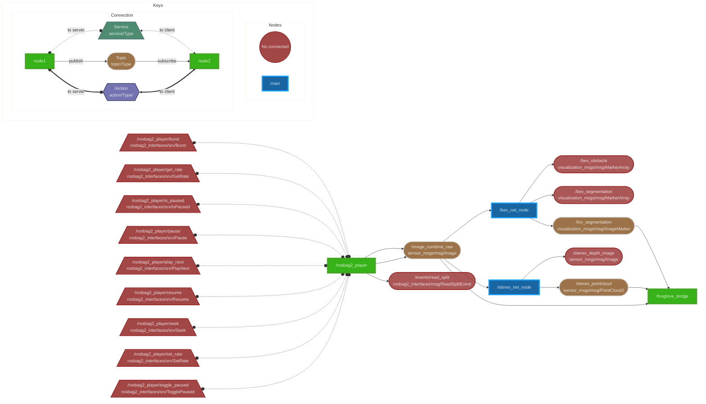

# 某个具体的实例

## 现象描述



会发生如下的现象：  

1. 先启动play，然后启动 bev 节点，再启动 stereo 节点，运行一段时间后，bev节点还是正常运行，stereo 节点就会卡住不动，并且是一种假死状态，因为我重启 rosbag play 节点就stereo还能恢复运行。  
2. 先启动play，然后启动 stereo 节点，再启动 bev 节点。则变成了 bev 节点陷入假死状态，也是可以通过重启 rosbag play恢复，说明bev并没有真的卡死或者崩溃。  
3. 先启动两个节点，再启动rosbag play 好像就不会卡死，因为观察的时间不够长，我不太确定。 
4. 两个节点是ai推理节点和对应的任务，虽然开发板只有一个BPU核心，可能会存在BPU调度被抢占，但是当某个节点卡住的时候，我如果kill另一个没有卡住的节点，这个当前假死的节点依然没法恢复，说明并不是抢占不到BPU的问题。  
5. 其他硬件资源为8核心cpu、8G内存。  

## trigger

通过 `gdb -p` attach 到后启动的节点之后，然后运行了 thread apply all bt，之后再 detach。进程可以从假死状态恢复。

## 原因分析

### 根本原因：ROS2 DDS 层的消息分发竞争

1. 启动顺序影响订阅优先级 - 先启动的节点在 DDS 层获得更高的消息分发优先级
2. 推理节点设置的 Qos 是 SensorDataQoS， 它是一种 BEST_EFFORT 策略 - 当系统负载高时，DDS 可能丢弃消息给后启动的节点
3. 单个 BPU 核心的资源竞争 - 虽然不是直接原因，但加剧了问题

### 为什么 GDB detach 和重启 rosbag 能恢复？

- GDB detach: 暂停了进程，让 DDS 层重新分配消息分发优先级
- 重启 rosbag: 重新建立了发布者连接，重置了 DDS 层的状态

# 现象特征

## 典型表现

- 进程响应性: 进程仍在运行，能响应系统信号，但停止正常的业务逻辑处理

- 资源状态: CPU 使用率低但非零，内存使用稳定，无明显资源泄漏

- 网络活动: 仍有网络 I/O 活动（如心跳、状态广播），但无业务数据流

- 可恢复性: 通过特定外部操作可以恢复正常运行

## 与真正死锁的区别

|特征|假死状态|真正死锁|
|---|---|---|
|信号响应|✅ 响应|❌ 不响应|
|系统调用|正常的等待调用|卡在特定调用|
|恢复可能性|✅ 可通过外部干预恢复|❌ 需要强制终止|
|资源状态|稳定|可能持续增长|

# 常见触发恢复的方法

## 1. 调试器干预

```shell
# GDB attach/detach 模式
gdb -p <PID>
(gdb) <some command>
(gdb) detach

# 原理：暂停进程执行，打破时序同步，重新分配资源优先级
```

## 2. 信号干预

```shell
# 发送非致命信号
kill -USR1 <PID>  # 用户自定义信号
kill -HUP <PID>   # 挂起信号（通常触发重新加载）

# 原理：中断当前等待状态，触发信号处理流程
```

## 3. 依赖服务重启

```shell
# 重启上游数据源
systemctl restart data-provider
# 或重启消息中间件
systemctl restart message-broker

# 原理：重新建立连接，重置分布式系统状态
```

## 4. 资源刷新

```shell
# 清理共享内存
ipcrm -m <shmid>
# 重置网络连接
ss -K dst <target_ip>

# 原理：强制释放可能卡住的系统资源
```

# 根本原因分类

## 1. 分布式系统竞争问题

特征: 多个组件竞争同一资源，导致某些组件"饿死"

常见场景:

- 消息队列的不公平分发（如 ROS2 DDS 的 BEST_EFFORT 模式）

- 数据库连接池竞争

- 负载均衡器的不均匀分配

诊断方法:

```shell
# 检查消息分发状态
ros2 topic hz /topic_name
# 检查连接池状态  
netstat -an | grep :5432 | wc -l
# 检查负载分布
curl -s http://lb-status/stats
```

### 2. 时序依赖问题

特征: 组件启动顺序或时序差异导致状态不一致

常见场景:

- 服务发现的竞态条件

- 配置更新的时序问题

- 缓存一致性延迟

诊断方法:

```shell
# 检查服务注册状态
consul members
etcdctl get --prefix /services/
# 检查时间同步
chrony sources -v
```

### 3. 资源分配不均

特征: 系统资源被不均匀分配，某些进程无法获得必要资源

常见场景:

- CPU 调度优先级问题

- 内存分配策略问题

- I/O 带宽竞争

诊断方法:

```shell
# 检查进程优先级
ps -eo pid,ni,pri,pcpu,comm
# 检查内存分配
cat /proc/<PID>/smaps | grep -E "(Size|Rss):"
# 检查 I/O 状态
iotop -p <PID>
```

# 预防和解决策略

## 1. 设计层面

- 公平性保证: 使用支持公平调度的中间件和协议

- 超时机制: 为所有阻塞操作设置合理超时

- 降级策略: 实现优雅降级，避免完全停止服务

- 状态检测: 添加健康检查和自恢复机制

## 2. 配置层面

```YAML
# 示例：ROS2 QoS 配置
qos_profile:
  reliability: RELIABLE      # 保证消息送达
  history: KEEP_LAST
  depth: 20                  # 增加缓冲区
  deadline: 200ms            # 设置超时
```

## 3. 监控层面

```shell
# 业务指标监控
watch -n 1 'ros2 topic hz /critical_topic'

# 系统资源监控  
watch -n 1 'ps aux | grep my_process'

# 网络连接监控
watch -n 1 'ss -tuln | grep :8080'
```

### 4. 运维层面

- 启动顺序控制: 使用依赖管理确保正确的启动顺序

- 自动重启: 配置监控系统检测假死状态并自动恢复

- 日志聚合: 集中收集和分析多组件日志

- 告警机制: 及时发现和响应异常状态

# 故障排查流程

## 1. 快速诊断

```shell
# 检查进程基本状态
ps aux | grep <process_name>
kill -0 <PID>  # 测试进程是否响应信号

# 检查系统调用状态
strace -p <PID> -e trace=all -c -f
```

## 2. 深入分析

```shell
# 获取调用栈
gdb -p <PID> -batch -ex "thread apply all bt" -ex "quit"

# 检查资源使用
lsof -p <PID>
cat /proc/<PID>/status
```

### 3. 环境分析

```shell
# 检查依赖服务状态
systemctl status dependency-service

# 检查网络连接
netstat -anp | grep <PID>

# 检查系统负载
uptime && free -h && df -h
```

# 最佳实践总结

1. 设计时考虑公平性: 避免使用可能导致"饿死"的资源分配策略

2. 实现超时和重试: 为所有外部依赖设置合理的超时和重试机制

3. 添加健康检查: 实现业务层面的健康检查，而不仅仅是进程存活检查

4. 日志和监控: 记录关键状态变化，便于问题排查

5. 测试启动顺序: 在不同启动顺序下测试系统稳定性

6. 文档化恢复步骤: 为运维团队提供清晰的故障恢复指南

这种"假死但可恢复"的问题通常比真正的死锁更难排查，因为系统表面上看起来正常，但实际上已经失去了处理业务逻辑的能力。关键是要理解分布式系统中的竞争和时序问题，并在设计时就考虑这些潜在风险。
