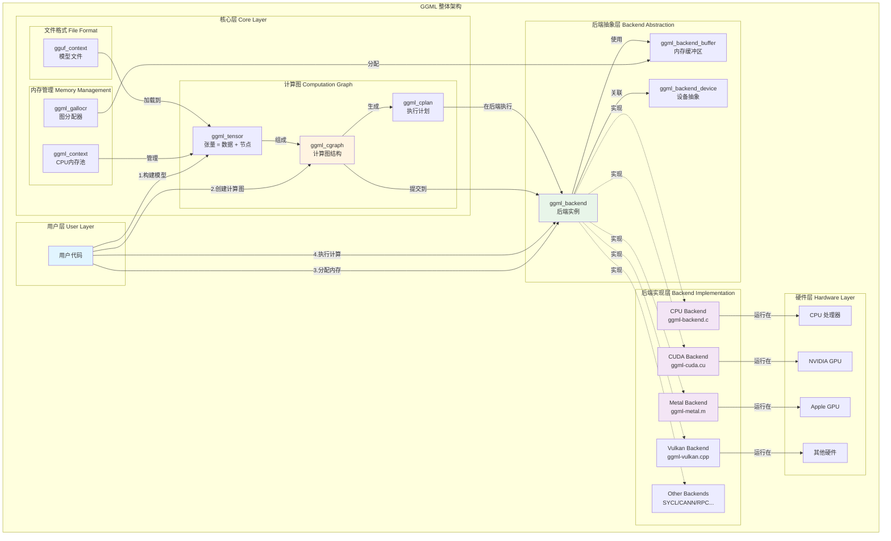
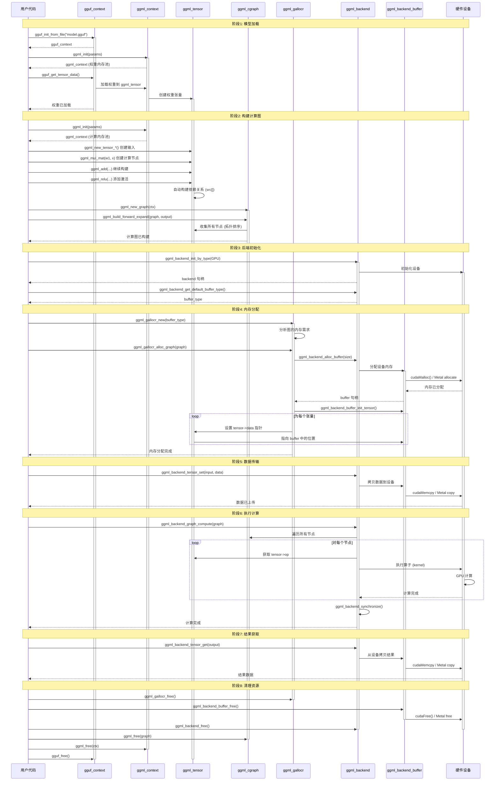
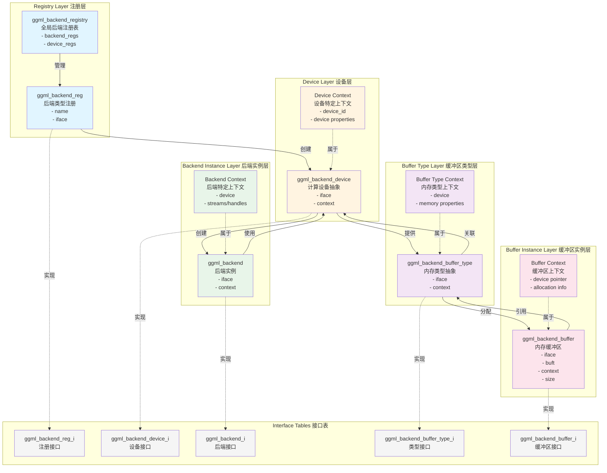

# 课程链接

[【大模型部署】GGML源码逐行调试带读！赶紧来看！\_哔哩哔哩\_bilibili](https://www.bilibili.com/video/BV1GAC9YXE5Q/?vd_source=a7368c6184a1b162acff7bf0efed19b2)

# 碎碎念

最近回首之前的工作内容和笔记，发现更多的是记录实践的过程，只做到了知其然，而不知所以然。

想在这次撰写笔记的过程中，深入的理解相关概念产生的原因。每一个概念的提出和对应的设计背后必然对应着某种需求

# 深入理解 GGUF

## GGUF 文件解析


diagram by [@mishig25](https://github.com/mishig25) (GGUF v3)

### `general.alignment` 元数据

> [!important] 目的
> mmap friendly

规定了全局的对齐规则。有些部分例如权重的数据要从**特定的内存地址或文件偏移量**开始，这个偏移量就是 `general.alignment` 的倍数。为了偏移，必然有 padding，padding 的内容为 `0x00`

除非明确指定，字段（fields）和数组（arrays）都是紧密排列的，不 align。通常是在解析完元数据之后，对齐权重的部分。

### little-endian

数据默认是 little-endian 的，*从 v3 开始支持大端。*

### 文件结构

```c
struct gguf_file_t {
    // The header of the file.
    gguf_header_t header;

    // Tensor infos, which can be used to locate the tensor data.
    gguf_tensor_info_t tensor_infos[header.tensor_count];

    // Padding to the nearest multiple of `ALIGNMENT`.
    //
    // That is, if `sizeof(header) + sizeof(tensor_infos)` is not a multiple of `ALIGNMENT`,
    // this padding is added to make it so.
    //
    // This can be calculated as `align_offset(position) - position`, where `position` is
    // the position of the end of `tensor_infos` (i.e. `sizeof(header) + sizeof(tensor_infos)`).
    uint8_t _padding[];

    // Tensor data.
    //
    // This is arbitrary binary data corresponding to the weights of the model. This data should be close
    // or identical to the data in the original model file, but may be different due to quantization or
    // other optimizations for inference. Any such deviations should be recorded in the metadata or as
    // part of the architecture definition.
    //
    // Each tensor's data must be stored within this array, and located through its `tensor_infos` entry.
    // The offset of each tensor's data must be a multiple of `ALIGNMENT`, and the space between tensors
    // should be padded to `ALIGNMENT` bytes.
    uint8_t tensor_data[];
};
```

这个结构体和上面的图片也是一一对应的

- `header`: 包括 magic number、版本、tensor_count、元数据 kv 数量、元数据 kv-pair
- `tensor_infos[header.tensor_count]`: 所有 tensor 的信息。包括名字、维度、各维度长度、数据类型、所在位置的偏移量
- `_padding[]`: padding 的数据，`[]` 也意味着不是定长。它根据 alignment 的数值和前面 `sizeof(header) + sizeof(tensor_infos)` 的大小来计算
- `tensor_data[]`: 二进制的权重数据

具体每一种类型的代码，见 [ggml/docs/gguf.md at master · ggml-org/ggml · GitHub](https://github.com/ggml-org/ggml/blob/master/docs/gguf.md#file-structure)

补充说明 `struct gguf_tensor_info_t`:

```c
struct gguf_tensor_info_t {
    // The name of the tensor. It is a standard GGUF string, with the caveat that
    // it must be at most 64 bytes long.
    gguf_string_t name;
    // The number of dimensions in the tensor.
    // Currently at most 4, but this may change in the future.
    uint32_t n_dimensions;
    // The dimensions of the tensor.
    uint64_t dimensions[n_dimensions];
    // The type of the tensor.
    ggml_type type;
    // The offset of the tensor's data in this file in bytes.
    //
    // This offset is relative to `tensor_data`, not to the start
    // of the file, to make it easier for writers to write the file.
    // Readers should consider exposing this offset relative to the
    // file to make it easier to read the data.
    //
    // Must be a multiple of `ALIGNMENT`. That is, `align_offset(offset) == offset`.
    uint64_t offset;
};
```

> [!warning] offset
> offset 是相对于权重 tensor_data 起始位置的偏移，即相对于上图中 rest of file 起始的位置的偏移。
> 这个设计是为了方便 writers 去写这个文件
> 而 reader 读取的时候需要注意相对文件起始的位置 ≠ offset

### 样例文件解析

按照 ggml 官方教程配置环境，然后使用 `examples/mnist` 的 train 脚本，得到 gguf

```shell
python3 mnist-train-fc.py mnist-fc-f32.gguf
```

mnist-fc-f32.gguf 包含的权重：

- fc1.weight: (500, 784)
- fc1.bias: (500,)
- fc2.weight: (10, 500)
- fc2.bias: (10,)


1 个 metadata_kv 解析：

- key.len = 20，然后是 `general.architecture` 共 20 个字符
- value_type = 8，即对应的是 string
- key.len = 8，然后是 `mnist-fc` 共 8 个字符

4 个 tensor infos 解析，仅以第一个为例：

- 第一个tensor：fc1.weight, offset = 0
	

找到所有 tensor 的 offset：【0，0x000000000017ED00=15680000，0x000000000017F4E0=1570016，0x0000000000184300=1590016】


从图中可以看到 padding 了 4 个字节，tensor data 的起始位置为 `0x00000100 = 256`

文件最后的字节情况：


可以看到最后还 padding 了一些 `0x00` 字节，也是为了对齐。

权重所占的字节数为： `0x00184427 - 0x00000100 + 0x1 = 1590056`

可以验证一下，最后的权重是 `fc2.bias` 共 10 个 float32，即 40 字节，偏移刚才算了是 1590016

因此权重数据结束的位置就是 `1590016 + 40 - 1 = 1590055`

### Appendix: Standardized tensor names

最大限度的减少复杂度和增加兼容性，符合传统的命名规范更好。

#### Base layers

`AA.weight` `AA.bias`

where `AA` can be:

- `token_embd`: Token embedding layer
- `pos_embd`: Position embedding layer
- `output_norm`: Output normalization layer
- `output`: Output layer

#### Attention and feed-forward layer blocks

`blk.N.BB.weight` `blk.N.BB.bias`

where N signifies the block number a layer belongs to, and where `BB` could be:

- `attn_norm`: Attention normalization layer
- `attn_norm_2`: Attention normalization layer
- `attn_qkv`: Attention query-key-value layer
- `attn_q`: Attention query layer
- `attn_k`: Attention key layer
- `attn_v`: Attention value layer
- `attn_output`: Attention output layer
- `ffn_norm`: Feed-forward network normalization layer
- `ffn_up`: Feed-forward network "up" layer
- `ffn_gate`: Feed-forward network "gate" layer
- `ffn_down`: Feed-forward network "down" layer
- `ffn_gate_inp`: Expert-routing layer for the Feed-forward network in MoE models
- `ffn_gate_exp`: Feed-forward network "gate" layer per expert in MoE models
- `ffn_down_exp`: Feed-forward network "down" layer per expert in MoE models
- `ffn_up_exp`: Feed-forward network "up" layer per expert in MoE models
- `ssm_in`: State space model input projections layer
- `ssm_conv1d`: State space model rolling/shift layer
- `ssm_x`: State space model selective parametrization layer
- `ssm_a`: State space model state compression layer
- `ssm_d`: State space model skip connection layer
- `ssm_dt`: State space model time step layer
- `ssm_out`: State space model output projection layer

## 为什么 GGUF 只存参数不存计算图

- 在 onnx 文件中，存储了模型的权重和完整的计算图
- 而 GGUF 文件只储存了模型的参数 + 少量的模型架构参数的元数据

这是因为 ONNX 设计的核心目标是**通用性**和**互操作性**，旨在成为不同的深度学习框架的 IR。为了实现这种通用性，ONNX 必须包含完整的计算图，这样任何支持 ONNX 的运行时都能准确地知道模型包包含哪些 OP、以何种顺序连接、以及如何调度。

| **特性**   | **GGUF (Generic GPT Unified Format)**                    | **ONNX (Open Neural Network Exchange)**        |
| -------- | -------------------------------------------------------- | ---------------------------------------------- |
| **核心目的** | 专用于 LLM 的**高效推理**和**极致量化**。                              | 作为深度学习框架之间的**通用中间表示**。                         |
| **存储内容** | **权重 (Tensors)** + **元数据** (模型架构参数)。                     | **权重** + 完整的**计算图** (Operators, Connections)。  |
| **推理方式** | **特定**的推理引擎（如 `llama.cpp`）**硬编码**了计算图，根据 GGUF 元数据选择运行路径。 | **通用**的推理引擎（如 ONNX Runtime）**解析**计算图，并执行图中的操作。 |
| **优势**   | 文件更**小**，加载/推理更**快**（尤其通过 mmap），量化效率高，**专一性强**。          | **通用性强**，支持各种模型架构和多平台部署，**互操作性好**。             |

GGUF 是为了 LLM 的高效推理设计的，而 LLM 的架构通常是**相对固定且标准化**的，可以认为计算图的结构是已知的，因此没必要记录完整的计算图。相对变化的部分就通过元数据（模型类型、层数、维度等）来保存，以此来选择推理引擎（llama.cpp）中已经实现的计算图。

比如说 attention 经过多次的迭代，已经有 MHA、GQA、MQA 的版本，它们反映在元数据上就是

- [MHA](https://ollama.com/library/llama2:latest/blobs/8934d96d3f08):
	```yaml
	llm.attention.head_count: 40
	llm.attention.head_count_kv: 40
	```
- [GQA](https://ollama.com/library/llama3:latest/blobs/6a0746a1ec1a):
	```yaml
	llm.attention.head_count: 64
	llm.attention.head_count_kv: 8
	```
- [MQA](https://ollama.com/library/starcoder:latest/blobs/b4a4eea1f5d8):
	```yaml
	llm.attention.head_count: 48
	llm.attention.head_count_kv: 1
	```

## GGUF 设计理念

提出的核心原因：

1. 解决 GGML 格式的限制：解决了 GGML 格式在元数据存储和可扩展性方面的问题。提供了一种更清晰、更结构化的方式来存储模型参数和架构信息。
2. 统一模型和元数据：在 huggingface 上，如 [llama3.1-8b](https://huggingface.co/meta-llama/Llama-3.1-8B/tree/main) 被分成好几个文件 `tokenizer.json` `config.json` `**.safetensors` 等。而 GGUF 的目标是将所有必要的信息（权重、分词器、架构参数、提示模版等）统一存储在一个二进制文件中，极大地简化了模型的分享和部署
3. 应对 LLM 架构和**量化**的快速发展：随着 GQA、MQA 以及各种新的量化方法（如 Q5_K、Q4_K_M）的出现，需要一个格式能够**灵活地**支持不断变化的参数和技术，同时保持对旧模型的兼容性

设计考量：

1. 最重要的是**针对消费级硬件做优化**
2. 极致的内存和加载效率（mmap friendly）
	1. 内存映射：格式被设计成 **aligned** 的二进制文件，这允许操作系统直接将模型权重从磁盘映射到内存，而**无需完全**加载到 RAM 中。极大地减少了模型**加载时间**和**启动延迟**，允许在只有少量 RAM 的设备上运行巨大的模型，因为它有效地利用了**虚拟内存**
	2. 单文件结构：避免了 I/O 碎片和多次文件读取，进一步优化了加载速度

| **效果维度**   | **详细解释**                                                                                                               |
| ---------- | ---------------------------------------------------------------------------------------------------------------------- |
| **加载速度**   | 🚀 **极快**。因为 OS 避免了耗时的**从磁盘到 RAM 的数据复制**操作。调用 `mmap` 几乎是瞬时的，模型的启动加载时间从几秒缩短到几毫秒。                                        |
| **RAM 占用** | 🤏 **更小**。只有正在使用的（或最近使用的）权重页才占用 RAM。这使得一个 13GB 的模型可以在只有 8GB RAM 的电脑上运行（当然，推理速度会变慢）。                                    |
| **启动延迟**   | ⏱️ **极低**。模型在被需要时才加载数据（按需加载），程序可以立即开始执行，无需等待整个文件被读取。                                                                   |
| **运行速度**   | 📉 **有代价**。如果模型太大导致需要的权重数据频繁不在 RAM 中，会触发**大量的缺页中断**和**磁盘 I/O**。这被称为**颠簸（Thrashing）**，此时推理速度会大幅下降，因为 CPU 必须等待慢速的磁盘操作完成。 |

3. 强大的量化支持
	1. 原生支持 GGML 量化： GGUF 直接集成了对 GGML 库中定义的各种高级量化方法的支持。**GGUF 是一种合同（Contract）**，它是一个**规范**，定义了**如何将** GGML 定义的量化数据和元数据**序列化**成一个单一的文件。之后 GGML 可以按照规范反序列化出量化类型和参数，从而调用相应的内核进行计算。
	2. 存储量化块的参数
4. 清晰且可扩展的元数据
	1. 键值对存储：用于存储所有非权重信息（模型类型、层数、注意力头数、分词器信息、LoRA/QLoRA 参数等）
	2. 向后兼容性：K-V 结构可以添加新的元数据字段，旧程序可以忽略它们不认识的新键
	3. 架构配置信息：用于指导构建计算图
5. 通用性和开放性
	1. 开放且统一：开源社区接受度高、支持度高，被视为本地 LLM 部署的事实标准
	2. 跨平台友好：作为专为 C/C++ 设计的二进制格式，它具有最小的外部依赖，使其能够在各种资源受限的平台上轻松编译运行

### GGUF 如何 aligned 从而做到 mmap friendly

### GGUF 如何支持量化

核心计算流程：

1. **存储阶段：** GGUF 文件存储的是：
    - **量化后的低比特权重：** 4-bit, 5-bit, 或 6-bit 整数数据。
    - **解量化元数据：** 对应每个权重块的尺度（Scale）、偏移（Offset）等关键参数。
2. **加载阶段：** 推理引擎通过 `mmap` 将 GGUF 文件中的这些量化权重和元数据映射到内存。
3. **计算阶段：** 当执行矩阵乘法时，推理引擎：
    - **调用定制内核：** GGML 提供了高度优化的内核（使用 SIMD 指令如 AVX-512、NEON 或 CUDA/Metal 内核），这些内核可以直接读取低比特权重和尺度，然后执行**快速的、近似的解量化和乘加操作**。
	    $$
	    Output_{\text{Block}} \approx \sum_{i} (\text{Scale} \times \text{Quant}_{\text{Weight}, i} + \text{Offset}) \times \text{Activation}_{i}
	    $$
    - **执行混合计算：** 内核会并行地、高效地执行以下操作：
        - **读取**少量低比特权重和尺度。
        - **快速近似解量化**（De-quantization）以获得近似的浮点值。
        - 将这些近似浮点值与**激活值（通常是 FP16/FP32）**进行乘加运算。
    - **输出激活值：** 最终的输出结果（下一层的激活值）是**浮点数**（通常是 FP16 或 FP32），然后这个浮点激活值会作为输入传递给模型的下一层。

总结要点：

- **数据存储是量化的** → 减小体积，节省带宽。
- **计算过程是浮点运算** → 保持精度。
- **关键是“定制内核”** → 这一层将“反量化”和“矩阵乘法”融合在一起，最大限度地减少了 I/O 开销，实现了高性能。

正是这种“**量化存储 + 运行时定制内核解量化到浮点计算**” 的策略，使得 GGUF 成为本地部署 LLM 的高性能标准。

# ggml 源码整体梳理

## 项目目标和对应的架构设计

项目目标：**高性能、轻量级、可移植的==张量和计算库==**

作为一个张量和计算库，那肯定需要关注如下几个方面，这也是自己从零构建一个类似的项目需要考虑的概念：

- 数据抽象层：张量与类型系统 (The Data Model)：定义了“计算什么”

| **考虑的方面**     | **设计目的与挑战**                                                      | **GGML/主流库的对应思路**                                                           |
| ------------- | ---------------------------------------------------------------- | --------------------------------------------------------------------------- |
| **1. 维度与形状**  | 如何灵活地表示任意维度和大小的数据（例如，从向量到五维张量）。                                  | 使用整数数组 $N_{\text{dims}}$ 和 $N_{\text{elements}}$（如 `ggml_tensor::ne`）来描述形状。 |
| **2. 数据类型系统** | 确定库支持的数值精度（$F32, F16, Bfloat16$）以及如何支持**量化**或**稀疏**格式。           | 必须定义一套可扩展的 `enum` 来表示类型，并设计定制的**块级量化**结构来平衡精度和内存。                           |
| **3. 内存布局**   | 决定数据在内存中的存储顺序（行主序 vs. 列主序），以及如何处理**步长 (Strides)** 以支持高效的视图（如转置）。 | 通常采用 $C$ 语言的行主序布局，并明确计算步长（`ggml_tensor::nb`）来处理复杂操作。                        |

- 执行引擎层：计算图与调度 (The Execution Model)：决定了“如何高效地计算”

| **考虑的方面**               | **设计目的与挑战**                                                           | **GGML/主流库的对应思路**                                      |
| ----------------------- | --------------------------------------------------------------------- | ------------------------------------------------------ |
| **4. 计算抽象 (Operators)** | 定义一套完整且原子化的数学操作（例如 `Add`, `Matmul`, `Conv`），作为构建模型的积木。                | 核心操作必须抽象为函数（如 `ggml_add`），并在张量中标记其操作类型。                |
| **5. 静态 vs. 动态图**       | 决定是像 PyTorch 那样**动态**（每一步都立即执行），还是像 GGML/TensorRT 那样**静态**（先构建图，后执行）。 | **GGML 采用静态图**：先构建 `ggml_cgraph`，这允许在执行前进行全局优化和内存分析。   |
| **6. 调度与优化**            | 如何在执行前对计算图进行优化（例如**操作融合**、**内存重用**、**并行化**）。                          | **GGML 采用手工优化和简化调度**：通过拓扑排序和简单的内存分配策略实现，将复杂融合留给底层内核实现。 |

- 资源管理层：内存与硬件 (The Resource Model)：决定了“资源如何分配和利用”

| **考虑的方面**     | **设计目的与挑战**                                          | **GGML/主流库的对应思路**                                                                 |
| ------------- | ---------------------------------------------------- | --------------------------------------------------------------------------------- |
| **7. 内存管理**   | 如何高效地分配、释放和重用内存，以减少碎片和系统调用开销。                        | **内存竞技场/上下文 (Context Arena)**：一次性分配大块内存，然后在其中切片分配张量，实现快速、无碎片分配。                   |
| **8. 异构计算支持** | 库是否支持 CPU、GPU (CUDA/Metal)、NPU 或其他加速器，以及如何实现统一的 API。 | **后端抽象**：定义一套统一的 Kernel 接口，通过条件编译或动态分派机制将操作路由到相应的硬件后端。                            |
| **9. 并行化策略**  | 如何在多核 CPU 或 GPU 上分配任务，以最大化硬件利用率。                     | **多线程和 SIMD/Intrinsic**：在 CPU 上使用 OpenMP 或手写的 SIMD 指令；在 GPU 上利用 CUDA/Metal 的并行模型。 |

- 性能与可移植性层 (The Deployment Model)：决定了“在哪里能运行，跑得多快”

| **考虑的方面**             | **设计目的与挑战**                                             | **GGML/主流库的对应思路**                                               |
| --------------------- | ------------------------------------------------------- | --------------------------------------------------------------- |
| **10. 极致的 Kernel 性能** | 确保核心操作（如矩阵乘法）在每个目标硬件上都达到最佳性能。                           | **手写 Kernel 优化**：使用特定于硬件的内在函数、汇编或性能库（如 cuBLAS for CUDA）来实现关键操作。 |
| **11. 跨平台兼容性**        | 库的核心代码必须易于在不同操作系统和 CPU 架构（x86, ARM, WebAssembly）上编译和运行。 | **纯 C/C++ 实现、最小化依赖**：这是 GGML 的核心优势，避免复杂的外部库依赖。                  |

- 生态系统与工具链层 (The Ecosystem Model)：决定了“如何被使用和扩展”

| **考虑的方面**       | **设计目的与挑战**                                               | **GGML/主流库的对应思路**                                    |
| --------------- | --------------------------------------------------------- | ---------------------------------------------------- |
| **12. 模型序列化格式** | 如何将训练好的模型权重和元数据保存成一个紧凑、易于加载的格式。                           | **GGUF 格式**：定义了一种包含所有张量数据和模型元数据（如 $KV$ 缓存配置）的统一文件格式。 |
| **13. API 友好性** | 库的 C/C++ API 必须易于理解和集成，并且方便其他语言（如 Python, Rust）通过 FFI 调用。 | **简洁的 C API**：提供一组扁平化的函数接口，而不是复杂的 C++ 类层次结构。         |

## GGUF、GGML、llama.cpp 的关系

| **实体**              | **类型**          | **角色和功能**                                                                                        | **依赖关系**                                |
| ------------------- | --------------- | ------------------------------------------------------------------------------------------------ | --------------------------------------- |
| **1. GGUF 文件**      | **文件格式**        | **数据契约/规范。** 定义了如何将 LLM 的权重、元数据、分词器信息和量化参数**统一存储**在一个文件中，且必须是 **mmap friendly** 的对齐二进制格式。        | 被 `llama.cpp` 读取。                       |
| **2. GGML 项目**      | **核心库 (C/C++)** | **高性能计算后端。** 是一个底层张量库，提供了在 CPU/GPU 上运行 LLM 所需的**高效、量化**的张量操作、矩阵乘法（GEMM）内核和优化的 K-V Cache 实现。      | 被 `llama.cpp` **使用/依赖**。是 GGUF 格式的基础技术。 |
| **3. llama.cpp 项目** | **应用项目/框架**     | **推理引擎。** 是一个具体的 LLM 推理应用，它实现了 **Transformer 架构的计算图**。它使用 GGML 库的能力，读取 GGUF 文件，并在各种平台上高效地运行 LLM。 | **依赖** GGML 库和 GGUF 文件格式。               |

## 核心数据结构体体系

将不同职责的数据分离到不同的结构体中：

```plaintext
┌─────────────────────────────────────────────────────────────┐
│                   GGML 架构层次                               │
├─────────────────────────────────────────────────────────────┤
│                                                              │
│  第1层: 数据层 (Data Layer)                                  │
│  ┌──────────────────────────────────────────────────────┐  │
│  │  ggml_tensor    - 张量数据 + 计算图节点                 │  │
│  │  ggml_object    - 内存对象元数据                        │  │
│  └──────────────────────────────────────────────────────┘  │
│                          ▲                                   │
│                          │                                   │
│  第2层: 内存管理层 (Memory Layer)                            │
│  ┌──────────────────────────────────────────────────────┐  │
│  │  ggml_context          - CPU内存池管理器                │  │
│  │  ggml_backend_buffer   - 后端内存缓冲区 (CPU/GPU)       │  │
│  │  ggml_backend          - 计算后端抽象 (CPU/CUDA/Metal)  │  │
│  └──────────────────────────────────────────────────────┘  │
│                          ▲                                   │
│                          │                                   │
│  第3层: 计算图层 (Graph Layer)                               │
│  ┌──────────────────────────────────────────────────────┐  │
│  │  ggml_cgraph    - 计算图 (节点拓扑关系)                 │  │
│  │  ggml_cplan     - 执行计划 (线程、内存等)               │  │
│  └──────────────────────────────────────────────────────┘  │
│                          ▲                                   │
│                          │                                   │
│  第4层: 文件格式层 (File Format Layer)                       │
│  ┌──────────────────────────────────────────────────────┐  │
│  │  gguf_context   - GGUF文件格式管理                      │  │
│  └──────────────────────────────────────────────────────┘  │
│                                                              │
└─────────────────────────────────────────────────────────────┘
```



## ggml 模块时序图



> [!hint] 注意
>  `ggml_gallocr` 是一个图级别的智能内存分配器，后续 `mnist` 的例子采用直接管理内存的方式，没用到它，这里简单了解一下：
> 
> 
> ```c
> struct ggml_gallocr {
>     ggml_backend_buffer_type_t * bufts; // [n_buffers]
>     ggml_backend_buffer_t * buffers; // [n_buffers]
>     struct ggml_dyn_tallocr ** buf_tallocs; // [n_buffers]
>     int n_buffers;
> 
>     struct ggml_hash_set hash_set;
>     struct hash_node * hash_values; // [hash_set.size]
> 
>     struct node_alloc * node_allocs; // [n_nodes]
>     int n_nodes;
> 
>     struct leaf_alloc * leaf_allocs; // [n_leafs]
>     int n_leafs;
> };
> ```
> 
> 优势：
> 
> - **自动内存复用**: 分析计算图的生命周期,让不同时刻的张量复用同一块内存
> - **跨后端支持**: 可以管理多个 `backend` 的 `buffer(n_buffers)`
> - **动态优化**: 使用 `ggml_dyn_tallocr` 进行动态内存分配和回收
> - **最优内存使用**: 只分配必要的内存,不需要用户估算 `buf_size`

## 核心结构体详解

### `ggml_tensor` 多维张量

设计意图：**数据** + **计算图节点** 的二合一设计

```c
struct ggml_tensor {
	enum ggml_type         type;

	GGML_DEPRECATED(enum ggml_backend_type backend, "use the buffer type to find the storage location of the tensor");

	struct ggml_backend_buffer * buffer;

	int64_t ne[GGML_MAX_DIMS]; // number of elements
	size_t  nb[GGML_MAX_DIMS]; // stride in bytes:
							   // nb[0] = ggml_type_size(type)
							   // nb[1] = nb[0]   * (ne[0] / ggml_blck_size(type)) + padding
							   // nb[i] = nb[i-1] * ne[i-1]

	// compute data
	enum ggml_op op;

	// op params - allocated as int32_t for alignment
	int32_t op_params[GGML_MAX_OP_PARAMS / sizeof(int32_t)];

	int32_t flags;

	struct ggml_tensor * grad;
	struct ggml_tensor * src[GGML_MAX_SRC];

	// source tensor and offset for views
	struct ggml_tensor * view_src;
	size_t               view_offs;

	void * data;

	char name[GGML_MAX_NAME];

	void * extra; // extra things e.g. for ggml-cuda.cu

	// char padding[4];
};
```

存储的数据：

- 形状信息：`ne[]`(各维度元素数)、`nb[]` (步长)
- 数据类型：`type`(F32, F16, Q4_0等32种量化类型)
- 数据指针：`data`(指向实际数值)
- 计算图信息: `op` (操作类型)、`src[]` (源张量)、`grad` (梯度)
- 元数据: `name` (名称)、`flags` (INPUT/OUTPUT/PARAM标记)
- 后端信息: `buffer` (所在的内存缓冲区)

### ggml_context 内存池管理器

设计意图：统一的内存管理，避免内存碎片

```c
struct ggml_context {
    size_t mem_size;
    void* mem_buffer;
    bool   mem_buffer_owned;
    bool   no_alloc;
    bool   no_alloc_save; // this is used to save the no_alloc state when using scratch buffers

    int    n_objects;

    struct ggml_object * objects_begin;
    struct ggml_object * objects_end;

    struct ggml_scratch scratch;
    struct ggml_scratch scratch_save;
};
```

存储的数据：

- **mem_size**: 内存池的总大小 (字节)
- **mem_buffer**: 指向内存池的指针
- **mem_buffer_owned**: 该内存是否由context拥有 (需要释放)
- **no_alloc**: 是否延迟分配张量数据 (只创建元数据)
- **no_alloc_save**: 保存 `no_alloc` 状态 (用于临时 scratch buffer)
- **n_objects**: 在此context中创建的对象数量
- **objects_begin**: 对象链表头
- **objects_end**: 对象链表尾
- **scratch**: 临时内存区域 (可复用)
- **scratch_save**: 保存的 scratch 状态

关键特性：

- Bump Allocator: 内存从前往后线性分配,超快速(无需查找空闲块)
- Object 链表: 所有对象用链表串联,便于遍历和释放
- Scratch Buffer: 可复用的临时内存,避免频繁分配
- no_alloc 模式: 可以先构建计算图结构,稍后再分配实际内存

### `ggml_cgraph` 计算图

设计意图：显式的计算图表示，支持自动微分和优化

```c
struct ggml_cgraph {
	int size;
	int n_nodes;
	int n_leafs;

	struct ggml_tensor ** nodes;
	struct ggml_tensor ** grads;
	struct ggml_tensor ** leafs;

	struct ggml_hash_set visited_hash_set;

	enum ggml_cgraph_eval_order order;
};
```

存储的数据：

- 节点数组: `nodes[]` (按**拓扑排序**的计算节点)
- 叶子节点: `leafs[]` (输入张量等，没有梯度的 tensor 就是 leaf)
- 梯度: `grads[]` (对应节点的梯度)
- 去重集合: `visited_hash_set` (防止重复添加，重复计算 tensor)
- 执行顺序: `order` (LEFT_TO_RIGHT/RIGHT_TO_LEFT)

详解：

- `int n_nodes` = 参数数量 + 中间操作数量
- `int n_leafs` = 输入张量数量 + 常量数量
- `ggml_tensor ** nodes`: 长度是 size，但是有效是 `[0, n_nodes-1]`
- `ggml_tensor ** leafs`: 长度是 size，但是有效是 `[0, n_leafs-1]`
- `ggml_tensor ** grads`: 长度是 size，但是有效是 `[0, n_nodes-1]`

| 张量类型  | op           | grad    | 所属数组  | 说明          |
| ----- | ------------ | ------- | ----- | ----------- |
| 参数    | GGML_OP_NONE | 非NULL   | nodes | 需要梯度，参与反向传播 |
| 输入/常量 | GGML_OP_NONE | NULL    | leafs | 不需要梯度，纯数据   |
| 计算节点  | 非NONE        | **可能有** | nodes | 执行计算        |

设计意图：

- nodes[] = 所有参与计算或梯度传播的节点

- leafs[] = 纯数据节点（不参与梯度传播）

- grads[] = 与 nodes[] 一一对应的梯度数组

以 `example/mnist-fc/` 目录的例子为例：

```c
// 输入
ggml_tensor * images = ggml_new_tensor_2d(ctx, F32, 784, batch);  // 1

// 第一层
ggml_tensor * fc1_w = ggml_new_tensor_2d(ctx, F32, 784, 500);     // 2
ggml_tensor * fc1_b = ggml_new_tensor_1d(ctx, F32, 500);          // 3
ggml_tensor * fc1   = ggml_mul_mat(ctx, fc1_w, images);           // 4
ggml_tensor * fc1_1 = ggml_add(ctx, fc1, fc1_b);                  // 5
ggml_tensor * fc1_2 = ggml_relu(ctx, fc1_1);                      // 6

// 第二层
ggml_tensor * fc2_w = ggml_new_tensor_2d(ctx, F32, 500, 10);      // 7
ggml_tensor * fc2_b = ggml_new_tensor_1d(ctx, F32, 10);           // 8
ggml_tensor * fc2   = ggml_mul_mat(ctx, fc2_w, fc1_2);            // 9
ggml_tensor * logits = ggml_add(ctx, fc2, fc2_b);                 // 10

// 损失
ggml_tensor * labels = ggml_new_tensor_2d(ctx, F32, 10, batch);   // 11
ggml_tensor * loss   = ggml_cross_entropy_loss(ctx, logits, labels); // 12

// 标记参数
ggml_set_param(ctx, fc1_w);
ggml_set_param(ctx, fc1_b);
ggml_set_param(ctx, fc2_w);
ggml_set_param(ctx, fc2_b);

// 构建图
ggml_cgraph * gf = ggml_new_graph(ctx);
ggml_build_forward_expand(gf, loss);


// 总共 12 个 tensors
// n_nodes = 10   (fc1_w, fc1_b, fc1, fc1_1, fc1_2, fc2_w, fc2_b, fc2, logits, loss)
// n_leafs = 2   (images, labels)
//   grads = 10  (fc1_w, fc1_b, fc1, fc1_1, fc1_2, fc2_w, fc2_b, fc2, logits, loss 的梯度)

// nodes[0..9]  有效
// leafs[0..1]  有效
// grads[0..11] 有效
```

图解：


图源：[GGML源码解读@比飞鸟贵重的多_HKL](https://www.bilibili.com/video/BV1GAC9YXE5Q/?p=10&share_source=copy_web&vd_source=356d2b526f97eb59b39fdd86ce54f1f3&t=13)

拓扑排序的过程见 [[#`ggml_visit_parents` 函数解析]]

### `ggml_cplan` 执行计划

设计意图：定义执行的资源需求，同一个 `ggml_graph` 可以设定不同的执行计划

```c
struct ggml_cplan {
	size_t    work_size; // size of work buffer, calculated by `ggml_graph_plan()`
	uint8_t * work_data; // work buffer, to be allocated by caller before calling to `ggml_graph_compute()`

	int n_threads;
	struct ggml_threadpool * threadpool;

	// abort ggml_graph_compute when true
	ggml_abort_callback abort_callback;
	void *              abort_callback_data;
};
```

- 需要多大的临时缓冲区（work_size）
- 临时缓冲区的地址（work_data）
- 线程数量和线程池
- 中止的回调

**作用**：

- 临时缓冲区管理
	- 很多操作需要临时的工作内存，例如：
		```c
			case GGML_OP_MUL_MAT:
		{
			const enum ggml_type vec_dot_type = type_traits[node->src[0]->type].vec_dot_type;

			if (node->src[1]->type != vec_dot_type) {
				cur = ggml_row_size(vec_dot_type, ggml_nelements(node->src[1]));
			}
		} break;
		```
		- 矩阵乘法可能需要类型转换的临时空间
		- 量化类型需要先解量化到 float
		- 卷积操作需要 im2col 的临时缓冲区
		- softmax 需要存储中间结果
	- 工作缓冲区是可以复用的，因为：
		- 不同节点**顺序**执行
		- 同一块 `work_buffer` 可以被多个操作复用
		- 因此只需分配“最大需求”的大小：
			```c
			work_size = MAX(work_size, cur);
			```
- 线程调度：
	- 根据 OP_TYPE 和可用线程数量，决定需要多少的 task
		```c
		    int max_tasks = 1;

	    // thread scheduling for the different operations + work buffer size estimation
	    for (int i = 0; i < cgraph->n_nodes; i++) {
	        struct ggml_tensor * node = cgraph->nodes[i];
	
	        const int n_tasks = ggml_get_n_tasks(node, n_threads);
	
	        max_tasks = MAX(max_tasks, n_tasks);
		```
	- 确定实际使用的线程数量
		```c
		cplan.n_threads = MIN(max_tasks, n_threads);
		```
- forward 时的参数传递
	```c
	struct ggml_compute_params params = {
		/*.ith       =*/ state->ith,
		/*.nth       =*/ state->threadpool->n_threads_cur,
		/*.wsize     =*/ cplan->work_size,
		/*.wdata     =*/ cplan->work_data,
		/*.threadpool=*/ state->threadpool,
	};

	for (int node_n = 0; node_n < cgraph->n_nodes; node_n++) {
		struct ggml_tensor * node = cgraph->nodes[node_n];

		ggml_compute_forward(&params, node);
	```

### `ggml_backend` 硬件抽象层

设计意图：硬件无关的抽象接口，支持多种后端

```c
// 不同的后端类型
ggml_backend_t          // 计算后端 (CPU/CUDA/Metal/Vulkan)
ggml_backend_buffer_t   // 后端内存缓冲区
ggml_backend_buffer_type_t // 缓冲区类型
```

存储的数据：

- 设备信息: 当前使用的硬件设备
- 内存管理: 该设备上的内存分配/释放
- 计算函数: 在该设备上执行操作的函数指针

### `gguf_context` 文件格式管理

设计意图：标准化的模型文件格式，支持元数据扩展

```c
struct gguf_context {
    struct gguf_header header;

    struct gguf_kv          * kv;
    struct gguf_tensor_info * infos;

    size_t alignment;
    size_t offset;    // offset of `data` from beginning of file
    size_t size;      // size of `data` in bytes

    //uint8_t * padding;
    void * data;
};
```

存储的数据：

- 元数据: KV键值对 (模型配置、超参数等)
- 张量信息: 张量名称、形状、偏移量
- 文件映射: 文件数据的内存映射

## 结构体分类

GGML 的结构体分类基于以下几个维度:

### 1. 按职责分离 (Separation of Concerns)

|结构体|职责|类比|
|---|---|---|
|ggml_tensor|数据存储 + 计算描述|变量 + 表达式|
|ggml_context|内存管理|内存池|
|ggml_cgraph|计算拓扑|语法树/AST|
|ggml_cplan|执行策略|执行计划|
|ggml_backend|硬件抽象|驱动层|
|gguf_context|文件IO|序列化器|

### 2. 按生命周期分离

```plaintext

生命周期:  短 ←──────────────────────→ 长

ggml_cplan  →  ggml_cgraph  →  ggml_tensor  →  ggml_context

(单次计算)    (一次构建)      (模型生命期)     (会话生命期)
```

### 3. 按可变性分离

- 不可变: `ggml_tensor` 的形状、类型、操作类型
- 可变但稳定: `ggml_tensor` 的数据内容 (权重在推理时不变)
- 频繁变化: `ggml_cgraph` 的中间结果、`ggml_cplan` 的工作内存

### 4. 按抽象层次分离

```plaintext
高层抽象:  gguf_context (文件格式)
           ggml_cgraph  (计算图)
           ──────────────────────
中层抽象:  ggml_context (内存管理)
           ggml_cplan   (执行计划)
           ──────────────────────
低层抽象:  ggml_tensor  (数据表示)
           ggml_backend (硬件接口)
```

## 上述结构体设计的好处

### 1. 清晰的职责边界

每个结构体只做一件事:

- `ggml_tensor` 只关心"数据是什么"
- `ggml_context` 只关心"内存在哪里"
- `ggml_cgraph` 只关心"如何计算"
- `ggml_backend` 只关心"在哪里计算"

### 2. 灵活的组合能力

```c
// 相同的张量可以用在不同的计算图中
ggml_tensor * weight = ...;
ggml_cgraph * train_graph = build_train_graph(weight);
ggml_cgraph * infer_graph = build_infer_graph(weight);

// 相同的计算图可以在不同后端执行
ggml_backend_cpu_compute(graph);
ggml_backend_cuda_compute(graph);
```

### 3. 高效的内存管理

```c
// 一次释放,清空所有张量
ggml_free(ctx);  // 无需逐个free tensor

// 分离权重和计算内存
ggml_context * ctx_weight;   // 100MB, 长期保持
ggml_context * ctx_compute;  // 1GB, 频繁重用
```

### 4. 易于扩展

- 添加新的量化类型 → 只修改 `ggml_type` 枚举
- 添加新的后端 → 实现 `ggml_backend` 接口
- 添加新的操作 → 只修改 `ggml_op` 枚举和实现函数

### 5. 硬件无关性

```c
// 同样的代码,不同的后端
#ifdef USE_CUDA
    backend = ggml_backend_cuda_init();
#elif USE_METAL
    backend = ggml_backend_metal_init();
#else
    backend = ggml_backend_cpu_init();
#endif
ggml_backend_graph_compute(backend, graph);
```

## 结构体设计模式总结

GGML 的结构体设计体现了多个经典设计模式:

1. 工厂模式: `ggml_context` 作为张量工厂
2. 策略模式: `ggml_backend` 抽象不同的计算策略
3. 组合模式: `ggml_tensor` 通过 `src[]` 构成树/图结构
4. 单一职责原则: 每个结构体职责明确
5. 开闭原则: 易于扩展(新后端、新操作),无需修改核心代码
6. [[#backend 设计 -- 依赖倒置|依赖倒置]]: 高层(`cgraph`)不依赖低层(`backend`)的具体实现

---

> [!important] ATTENTION
> 接下来，就以 `examples/mnist/` 作为例子，来详细解析各个数据结构、计算图构建等概念
> 
> 版本约定为 [ggml](https://github.com/ggml-org/ggml.git) commit id ea40f60c2

# 以 `examples/mnist/` 为例解读 ggml 推理

## 1. `mnist_model_init_from_file` 函数解析

```c
mnist_model model = mnist_model_init_from_file(argv[1]);
```

1. 申请两个 `ggml_context`，一个用于存储模型权重 (`ctx_weight`)，一个用于存储计算结果 (`ctx_compute`)
2. 从 `gguf` 文件中载入模型信息到 `gguf_context`，模型权重读取到一个新的 `ggml_context` 并作为 `model.ctx_weight`。因此第 1 步 malloc 的 `ctx_weight` 就不再使用了。
	1. 读取权重过程涉及到 `ggml_context` 管理权重 `ggml_tensor` 对象 (object)，借此机会再来详细解读一下 `ggml_context` 结构

### 1.1 `ggml_context` 结构解析

> [!INFO] 作用
> 作为一个容器，装载各类对象（张量 ggml_tensor、计算图 ggml_cgraph、其他数据 ggml_cplan 等）

```c
struct ggml_context {
    size_t mem_size;
    void* mem_buffer;
    bool   mem_buffer_owned;
    bool   no_alloc;
    bool   no_alloc_save; // this is used to save the no_alloc state when using scratch buffers

    int    n_objects;

    struct ggml_object * objects_begin;
    struct ggml_object * objects_end;

    struct ggml_scratch scratch;
    struct ggml_scratch scratch_save;
};
```

`ggml_context` 是一个内存池，即一段连续的内存，里面存放了 `n_objects`，并且是通过 `ggml_object` 链表来将对象串联起来的（这是为了在内存池查找/定位对象）

> [!question] 为什么不直接记录对象的地址呢？
> 因为对象的类型是多样的，虽然当前只有三种：tensor、graph、work buffer，但是后续或许还要扩展呢？
> 如果直接记录对象的地址，就要变成
> - struct ggml_tensor ** tensors
> - struct ggml_cgraph ** graphs
> - struct ggml_cplan ** work_buffers
> 
> 扩展性很差

一个 `ggml_context` 内部的数据大概长这样：

```plaintext
|ggml_object|ggml_tensor/ggml_graph/ggml_work_buffer|object_data|ggml_object|ggml_tensor/ggml_graph/ggml_work_buffer|object_data|...|ggml_object|ggml_tensor/ggml_graph/ggml_work_buffer|object_data|
```

`mnist-fc` 模型的权重加载到 `ggml_context` 之后，内存图：


图源：[GGML源码解读@比飞鸟贵重的多_HKL](https://www.bilibili.com/video/BV1GAC9YXE5Q/?p=6&share_source=copy_web&vd_source=356d2b526f97eb59b39fdd86ce54f1f3&t=4)

- 图片最下方的“内存池”存储了模型的权重
- 第 1 个 `|ggml_object|ggml_tensor|object_data|` 存储了所有的权重数据
- 后续 4 个 `|ggml_object|ggml_tensor|` 分别对应了 `fc1_weight`, `fc1_bias`, `fc2_weight`, `fc2_bias` 四个权重，它们 `ggml_tensor` 内部的 `void *data` 指向对应的权重数据（黄色部分），因此不需要申请新的 `object_data`

### 1.2 初始化模型权重

```c
	struct gguf_init_params params = {
		/*.no_alloc =*/ false,
		/*.ctx =*/ &model.ctx_weight,
	};
	gguf_context * ctx = gguf_init_from_file(fname.c_str(), params);
	...
	if (model.arch == "mnist-fc") {
		model.fc1_weight = ggml_get_tensor(model.ctx_weight, "fc1.weight");
		...
		...
	}
```

在初始化 `gguf_context` 的时候，`&model.ctx_weight` 传入了指针作为参数，被修改成了指涉上图最下方的 `ggml_context`

此时通过 `model.fc1_weight = ggml_get_tensor(model.ctx_weight, "fc1.weight");` 类似的代码读取对应的 `tensor` 并设置为模型的权重

## 2. `mnist_model_build` 函数解析

要在 `ctx_compute` 中申请对象：

- 四个权重 `fc1_weight`, `fc1_bias`, `fc2_weight`, `fc2_bias` 对应的 grad，也是 `ggml_tensor`
- 输入 `images`, `labels`
- 输出 `logits`, `probs`, `loss`
- 中间的计算结果，每个 OP （除非 inplace）都会产生中间结果，这个中间结果也要存储，因此传入了 `ctx_compute` 参数用于存储
	```c
	        ggml_tensor * fc1 = ggml_relu(model.ctx_compute, ggml_add(model.ctx_compute,
            ggml_mul_mat(model.ctx_compute, model.fc1_weight, model.images),
            model.fc1_bias));
        model.logits = ggml_add(model.ctx_compute,
            ggml_mul_mat(model.ctx_compute, model.fc2_weight, fc1),
            model.fc2_bias);
	```

上面的这些算子加上 `ggml_soft_max`, `ggml_cross_entropy_loss` 将所有的 tensor 串成了一个拓扑图，而如何执行计算，解析来要构建 `cgprah` 对它们进行拓扑排序。

先预览一下最终的拓扑排序结果：


图源：[GGML源码解读@比飞鸟贵重的多_HKL](https://www.bilibili.com/video/BV1GAC9YXE5Q/?p=10&share_source=copy_web&vd_source=356d2b526f97eb59b39fdd86ce54f1f3&t=13)

## 3. `mnist_model_eval` 函数解析

- 首先会在 `ctx_compute` 申请一个 `ggml_cgraph` 对象
- 然后利用哈希表去重的效果，对 `ggml_cgraph` 的 `nodes`, `leafs` 进行排序和初始化

### 3.1 `ggml_new_graph` 函数解析

在`ctx_compute` 申请一个 [[#`ggml_cgraph` 计算图|ggml_cgraph]] 对象

graph 大小设置的是 `GGML_DEFAULT_GRAPH_SIZE=2048`，可以容纳最多 2048 个 nodes，2048 个 leafs，2048 个 grads

### 3.2 `ggml_visit_parents` 函数解析

```c
static void ggml_visit_parents(struct ggml_cgraph * cgraph, struct ggml_tensor * node) {
    if (node->grad == NULL) {
        // this usually happens when we generate intermediate nodes from constants in the backward pass
        // it can also happen during forward pass, if the user performs computations with constants
        if (node->op != GGML_OP_NONE) {
            //GGML_PRINT_DEBUG("%s: warning: node %p has no grad, but op %d\n", __func__, (void *) node, node->op);
        }
    }

    // check if already visited，如果已经访问过了，跳过，避免重复计算
    if (ggml_hash_insert(&cgraph->visited_hash_set, node) == GGML_HASHSET_ALREADY_EXISTS) {
        return;
    }

    // 深度优先搜索，遍历所有的 src tensors
    for (int i = 0; i < GGML_MAX_SRC; ++i) {
        const int k =
            (cgraph->order == GGML_CGRAPH_EVAL_ORDER_LEFT_TO_RIGHT) ? i :
            (cgraph->order == GGML_CGRAPH_EVAL_ORDER_RIGHT_TO_LEFT) ? (GGML_MAX_SRC-1-i) :
            /* unknown order, just fall back to using i*/ i;
        if (node->src[k]) {
            ggml_visit_parents(cgraph, node->src[k]);
        }
    }

    // 判断 tensor 是 node 还是 leaf
    if (node->op == GGML_OP_NONE && node->grad == NULL) {
        // reached a leaf node, not part of the gradient graph (e.g. a constant)
        GGML_ASSERT(cgraph->n_leafs < cgraph->size);

        if (strlen(node->name) == 0) {
            ggml_format_name(node, "leaf_%d", cgraph->n_leafs);
        }

        cgraph->leafs[cgraph->n_leafs] = node;
        cgraph->n_leafs++;
    } else {
        GGML_ASSERT(cgraph->n_nodes < cgraph->size);

        if (strlen(node->name) == 0) {
            ggml_format_name(node, "node_%d", cgraph->n_nodes);
        }

        cgraph->nodes[cgraph->n_nodes] = node;
        if (cgraph->grads) {
            cgraph->grads[cgraph->n_nodes] = node->grad;
        }
        cgraph->n_nodes++;
    }
}
```

最终遍历完后得到了初始化完毕的 `ggml_cgprah`，拓扑顺序如下：


图源：[GGML源码解读@比飞鸟贵重的多_HKL](https://www.bilibili.com/video/BV1GAC9YXE5Q/?p=10&share_source=copy_web&vd_source=356d2b526f97eb59b39fdd86ce54f1f3&t=13)

### 3.3 `ggml_graph_plan` 函数解析

- 遍历所有节点，计算每个操作需要的临时空间，交由 [[#`ggml_cplan` 执行计划|ggml_cplan]] 来管理。**临时空间可复用**

涉及到的数据结构 `ggml_cplan`：

```c
struct ggml_cplan {
	size_t    work_size; // size of work buffer, calculated by `ggml_graph_plan()`
	uint8_t * work_data; // work buffer, to be allocated by caller before calling to `ggml_graph_compute()`

	int n_threads;
	struct ggml_threadpool * threadpool;

	// abort ggml_graph_compute when true
	ggml_abort_callback abort_callback;
	void *              abort_callback_data;
};
```

`ggml_cplan` 也是一个对象，会在 `ctx_compute` 进行管理，新申请的对象在内存中是：`|ggml_object|cplan.work_data(len is cplan.work_size)|`

资源分配好了，接下来开始计算 `ggml_graph_compute`

### 3.4 `ggml_graph_compute` 函数解析

- 因为没有传入线程池，创建临时的 (disposable) 线程池来执行计算
- 执行 workers

#### 3.4.1 `ggml_threadpool_new_impl` 函数分析

创建线程池，线程池结构为：

```c
struct ggml_threadpool {
    ggml_mutex_t mutex;       // mutex for cond.var
    ggml_cond_t  cond;        // cond.var for waiting for new work

    struct ggml_cgraph * cgraph;
    struct ggml_cplan  * cplan;

    // synchronization primitives
    atomic_int n_graph;       // incremented when there is work to be done (i.e each graph)
    atomic_int n_barrier;
    atomic_int n_barrier_passed;
    atomic_int current_chunk; // currently processing chunk during Mat_Mul, shared between all the threads.

    // these are atomic as an annotation for thread-sanitizer
    atomic_bool stop;         // Used for stopping the threadpool altogether
    atomic_bool pause;        // Used for pausing the threadpool or individual threads

    struct ggml_compute_state * workers;   // per thread state
    int          n_threads_max; // number of threads in the pool
    int          n_threads_cur; // number of threads used in the current graph

    int32_t      prio;        // Scheduling priority
    uint32_t     poll;        // Polling level (0 - no polling)

    enum ggml_status ec;
};
```

OpenMP 时主要关注：

- 要计算的图 `cgraph`
- 计算资源 `cplan`
- 所有线程的状态 `workers`
	```c
		struct ggml_compute_state {
	#ifndef GGML_USE_OPENMP
	    ggml_thread_t thrd;
	    bool cpumask[GGML_MAX_N_THREADS];
	    int  last_graph;
	    bool pending;
	#endif
		// 所有的线程需要知道自己属于哪个线程池，这样线程可以访问共享状态，如 cgraph, cplan
	    struct ggml_threadpool * threadpool;
	    // 知道自己是第几个线程。如分块操作时取第 ith 块数据进行计算
	    int ith;
	};
	```

设置 workers：

```c
    const size_t workers_size = sizeof(struct ggml_compute_state) * tpp->n_threads;
    struct ggml_compute_state * workers = GGML_ALIGNED_MALLOC(workers_size);

    memset(workers, 0, workers_size);
    for (int j = 0; j < tpp->n_threads; j++) {
        workers[j].threadpool = threadpool;
        workers[j].ith        = j;
    }
```

#### 3.4.2 `ggml_graph_compute_thread` 函数解析

OpenMP 版本下，每个 thread 执行对应的 worker

```c
ggml_graph_compute_thread(&threadpool->workers[omp_get_thread_num()]);
```

首先拿到**共享的**状态/数据，并设置 compute 参数：

```c
static thread_ret_t ggml_graph_compute_thread(void * data) {
    struct ggml_compute_state * state = (struct ggml_compute_state *) data;

    const struct ggml_cgraph * cgraph = state->threadpool->cgraph;
    const struct ggml_cplan  * cplan  = state->threadpool->cplan;

    set_numa_thread_affinity(state->ith);

    struct ggml_compute_params params = {
        /*.ith       =*/ state->ith,
        /*.nth       =*/ state->threadpool->n_threads_cur,
        /*.wsize     =*/ cplan->work_size,
        /*.wdata     =*/ cplan->work_data,
        /*.threadpool=*/ state->threadpool,
    };
```

每个线程都会遍历所有节点，节点仍旧是按照顺序执行，节点内部会并行化操作：

```c
	// 所有线程都会遍历所有节点
    for (int node_n = 0; node_n < cgraph->n_nodes; node_n++) {
        struct ggml_tensor * node = cgraph->nodes[node_n];

		// params 中含有线程的序号 ith，所有的线程并行处理，分别处理对应的第 ith 块“子”任务
        ggml_compute_forward(&params, node);

        if (state->ith == 0 && cplan->abort_callback && cplan->abort_callback(cplan->abort_callback_data)) {
            state->threadpool->ec = GGML_STATUS_ABORTED;
        }

		// barrier 确保线程在同一个节点上同步，保证节点按顺序执行
        ggml_barrier(state->threadpool);

        if (state->threadpool->ec != GGML_STATUS_SUCCESS) {
            break;
        }
    }
```

> [!check] Woo
> 这是 SPMD + Barrier 并行模型！

以 `mul_mat` 为例 `ggml_compute_forward_mul_mat(params, tensor);`：

```c
for (int64_t i13 = 0; i13 < ne13; ++i13) {
            for (int64_t i12 = 0; i12 < ne12; ++i12) {
                int64_t i11_processed = 0;
                if ((ggml_n_dims(src1) == 2) && from_float_to_mat && gemm) {
                    for (int64_t i11 = ith * 4; i11 < ne11 - ne11 % 4; i11 += nth * 4) {
                        from_float_to_mat((float *)((char *) src1->data + i13*nb13 + i12*nb12 + i11*nb11),
                                          (void *)               (wdata + i13*nbw3 + i12*nbw2 + i11*nbw1),
                                          4, ne10, blck_size_interleave);
                    }
                    i11_processed = ne11 - ne11 % 4;
                }
                for (int64_t i11 = i11_processed + ith; i11 < ne11; i11 += nth) {
                    from_float((float *)((char *) src1->data + i13*nb13 + i12*nb12 + i11*nb11),
                           (void *)               (wdata + i13*nbw3 + i12*nbw2 + i11*nbw1),
                           ne10);
                }
            }
        }
```

粗看里面用到了 `ith = params.ith` ，说明肯定用到了分块矩阵乘！

# backend 设计 -- 依赖倒置

```plaintext
┌─────────────────────────────────────────────────────────────┐
│                   依赖倒置架构                               │
├─────────────────────────────────────────────────────────────┤
│                                                              │
│  高层模块 (High-Level)                                       │
│  ┌────────────────────────────────────────────────────┐    │
│  │  ggml_cgraph (计算图)                               │    │
│  │  - 只知道有节点和操作                                │    │
│  │  - 不知道在哪里执行                                  │    │
│  └───────────────────┬────────────────────────────────┘    │
│                      │ 依赖                                 │
│                      ↓                                      │
│  ┌────────────────────────────────────────────────────┐    │
│  │  抽象接口层 (Abstract Interface)                    │    │
│  │  ggml_backend_i (接口定义)                          │    │
│  │  ─────────────────────────────────────────────────  │    │
│  │  - graph_compute(backend, cgraph)                  │    │
│  │  - supports_op(backend, op)                        │    │
│  │  - synchronize(backend)                            │    │
│  └───────────────────┬────────────────────────────────┘    │
│                      ↑ 实现                                 │
│                      │                                      │
│  低层模块 (Low-Level Implementations)                       │
│  ┌──────────────┐  ┌──────────────┐  ┌──────────────┐    │
│  │ CPU Backend  │  │ CUDA Backend │  │Metal Backend │    │
│  │ 实现接口     │  │ 实现接口     │  │ 实现接口     │    │
│  └──────────────┘  └──────────────┘  └──────────────┘    │
│                                                              │
│  关键: 高层依赖抽象接口,不依赖具体实现!                     │
└─────────────────────────────────────────────────────────────┘
```

## 核心机制：接口 + 函数指针表

1. 定义抽象接口：这是一个函数指针**表**，定义了所有后端必须实现的接口
	```c
	struct ggml_backend_i {
	const char * (*GGML_CALL get_name)(ggml_backend_t backend);

	void (*GGML_CALL free)(ggml_backend_t backend);

	// buffer allocation
	ggml_backend_buffer_type_t (*GGML_CALL get_default_buffer_type)(ggml_backend_t backend);

	// (optional) asynchronous tensor data access
	void (*GGML_CALL set_tensor_async)(ggml_backend_t backend,       struct ggml_tensor * tensor, const void * data, size_t offset, size_t size);
	void (*GGML_CALL get_tensor_async)(ggml_backend_t backend, const struct ggml_tensor * tensor,       void * data, size_t offset, size_t size);
	bool (*GGML_CALL cpy_tensor_async)(ggml_backend_t backend_src, ggml_backend_t backend_dst, const struct ggml_tensor * src, struct ggml_tensor * dst);

	// (optional) complete all pending operations
	void (*GGML_CALL synchronize)(ggml_backend_t backend);

	// compute graph with a plan (not used currently)
	// create a new plan for a graph
	ggml_backend_graph_plan_t (*GGML_CALL graph_plan_create) (ggml_backend_t backend, const struct ggml_cgraph * cgraph);
	void                      (*GGML_CALL graph_plan_free)   (ggml_backend_t backend, ggml_backend_graph_plan_t plan);
	// update the plan with a new graph - this should be faster than creating a new plan when the graph has the same topology
	void                      (*GGML_CALL graph_plan_update) (ggml_backend_t backend, ggml_backend_graph_plan_t plan, const struct ggml_cgraph * cgraph);
	// compute the graph with the plan
	enum ggml_status          (*GGML_CALL graph_plan_compute)(ggml_backend_t backend, ggml_backend_graph_plan_t plan);

	// compute graph without a plan (async)
	enum ggml_status (*GGML_CALL graph_compute)     (ggml_backend_t backend, struct ggml_cgraph * cgraph);

	// check if the backend can compute an operation
	bool (*GGML_CALL supports_op)(ggml_backend_t backend, const struct ggml_tensor * op);

	// check if the backend can use tensors allocated in a buffer type
	bool (*GGML_CALL supports_buft)(ggml_backend_t backend, ggml_backend_buffer_type_t buft);

	// check if the backend wants to run an operation, even if the weights are allocated in a CPU buffer
	// these should be expensive operations with large batch sizes that may benefit from running on this backend
	// even if the weight has to be copied from the CPU temporarily
	bool (*GGML_CALL offload_op)(ggml_backend_t backend, const struct ggml_tensor * op);

	// (optional) event synchronization
	// create a new event that can record events on this backend instance
	ggml_backend_event_t (*GGML_CALL event_new)         (ggml_backend_t backend);
	void                 (*GGML_CALL event_free)        (ggml_backend_event_t event);
	// record an event on the backend instance that created it
	void                 (*GGML_CALL event_record)      (ggml_backend_event_t event);
	// wait for an event on on a different backend instance
	void                 (*GGML_CALL event_wait)        (ggml_backend_t backend, ggml_backend_event_t event);
	// block until an event is recorded
	void                 (*GGML_CALL event_synchronize) (ggml_backend_event_t event);
	};
	```
2. Backend 结构体包含接口： `iface` 字段存储了函数指针表
	```c
	struct ggml_backend {
	ggml_guid_t guid;

	struct ggml_backend_i iface;
	ggml_backend_context_t context;
	};

	typedef struct ggml_backend * ggml_backend_t;
	```

### 句柄 (Handler)

ggml 遵守 POSIX 标准的命名约定，对句柄加上 `_t` 后缀，如 `typedef struct ggml_backend * ggml_backend_t;`。好处：

1. 一眼看出是类型定义
2. 避免与变量名冲突
3. 符合C语言社区习惯

ggml 中的句柄体系：

```plaintext
GGML 句柄类型 (都是 _t 结尾)

┌─────────────────────────────────────────────┐
│  资源管理类                                  │
├─────────────────────────────────────────────┤
│  ggml_context_t              内存池句柄      │
│  ggml_backend_t              计算后端句柄    │
│  ggml_backend_buffer_t       内存缓冲区句柄  │
│  ggml_backend_buffer_type_t  缓冲区类型句柄  │
│  gguf_context_t              文件格式句柄    │
└─────────────────────────────────────────────┘

特点:
1. 所有都是不透明指针
2. 只能通过 API 操作
3. 隐藏实现细节
4. 保证封装性
```

### 不透明指针 (Opaque Pointer)

> [!INFO] 定义
> 不透明指针是一种只声明类型,但不暴露内部结构的**设计模式**。

❌透明指针（用户可以看到内部）：

```c
// ========== header.h (用户可见) ==========
struct ggml_backend {
    ggml_guid_t guid;
    struct ggml_backend_i iface;
    ggml_backend_context_t context;
};

typedef struct ggml_backend * ggml_backend_t;

// ========== user.c (用户代码) ==========
ggml_backend_t backend = ggml_backend_cpu_init();

// 用户可以直接访问内部!
printf("GUID: %d\n", backend->guid);           // ✓ 可以访问
backend->iface.graph_compute = my_function;    // ✓ 可以修改
backend->context = NULL;                       // ✓ 可以破坏

// 问题:
// 1. 用户可能破坏内部状态
// 2. 如果修改结构体,所有用户代码都要重新编译
// 3. 无法保证封装性
```

✅不透明指针（用户看不到内部）：

```c
// ========== ggml-backend.h (用户可见的头文件) ==========
// 只有前向声明,没有定义!
typedef struct ggml_backend * ggml_backend_t;

// 用户只能通过 API 访问
GGML_API const char * ggml_backend_name(ggml_backend_t backend);
GGML_API void ggml_backend_free(ggml_backend_t backend);
GGML_API enum ggml_status ggml_backend_graph_compute(
    ggml_backend_t backend, 
    struct ggml_cgraph * cgraph
);

// ========== ggml-backend-impl.h (只有实现者可见) ==========
struct ggml_backend {
    ggml_guid_t guid;
    struct ggml_backend_i iface;
    ggml_backend_context_t context;
};

// ========== user.c (用户代码) ==========
ggml_backend_t backend = ggml_backend_cpu_init();

// 用户无法直接访问内部!
printf("%d\n", backend->guid);  // ❌ 编译错误! 不知道 struct ggml_backend 的定义
backend->context = NULL;         // ❌ 编译错误!

// 必须通过 API
const char * name = ggml_backend_name(backend);  // ✓ 正确方式
ggml_backend_graph_compute(backend, graph);      // ✓ 正确方式
```

实现机制：

```plaintext
文件组织:

┌─────────────────────────────────────────────────┐
│  include/ggml-backend.h (公开头文件)             │
├─────────────────────────────────────────────────┤
│  // 只有声明,没有定义                            │
│  typedef struct ggml_backend * ggml_backend_t;  │
│                                                  │
│  // 只有函数声明                                 │
│  GGML_API void ggml_backend_free(               │
│      ggml_backend_t backend);                   │
└─────────────────────────────────────────────────┘
                    ↑
                    │ 用户只能看到这个
                    │
┌─────────────────────────────────────────────────┐
│  src/ggml-backend-impl.h (内部头文件)            │
├─────────────────────────────────────────────────┤
│  // 完整定义                                     │
│  struct ggml_backend {                          │
│      ggml_guid_t guid;                          │
│      struct ggml_backend_i iface;               │
│      ggml_backend_context_t context;            │
│  };                                              │
└─────────────────────────────────────────────────┘
                    ↑
                    │ 只有实现者能看到
                    │
┌─────────────────────────────────────────────────┐
│  src/ggml-backend.c (实现文件)                   │
├─────────────────────────────────────────────────┤
│  #include "ggml-backend-impl.h"                 │
│                                                  │
│  void ggml_backend_free(ggml_backend_t backend) │
│  {                                               │
│      backend->iface.free(backend);  // 可以访问  │
│      free(backend);                             │
│  }                                               │
└─────────────────────────────────────────────────┘
```

好处：

- 封装性
	```c
	// 用户无法绕过 API 直接修改内部状态
	ggml_backend_t backend = ggml_backend_cpu_init();
	
	// ❌ 无法做坏事
	backend->context = NULL;  // 编译错误!
	backend->iface.graph_compute = hack_function;  // 编译错误!
	
	// ✓ 必须通过正确的 API
	ggml_backend_free(backend);  // 正确的清理方式
	```
- ABI 稳定性
	```c
	// 版本 1.0
	struct ggml_backend {
	    ggml_guid_t guid;
	    struct ggml_backend_i iface;
	    ggml_backend_context_t context;
	};
	
	// 版本 2.0 - 添加新字段
	struct ggml_backend {
	    ggml_guid_t guid;
	    struct ggml_backend_i iface;
	    ggml_backend_context_t context;
	    int version;           // 新增!
	    void * user_data;      // 新增!
	};
	
	// 如果是透明指针:
	// - 用户代码使用了 sizeof(struct ggml_backend)
	// - 必须重新编译所有用户代码!
	
	// 如果是不透明指针:
	// - 用户只使用指针,不知道大小
	// - 不需要重新编译用户代码!
	// - 只需要重新链接新的库
	
	
	
	// 用户代码 (编译时)
	ggml_backend_t backend = ggml_backend_cpu_init();
	// 编译器只知道这是一个指针 (8字节),不知道结构体大小
	// 所以修改结构体不影响用户代码!
	
	// 如果是透明指针
	struct ggml_backend backend;  // 编译器需要知道大小!
	// 修改结构体后,这行代码的大小就变了,必须重新编译
	```
- 隐藏实现细节
	```c
	// 公开 API - 简洁明了
	typedef struct ggml_backend * ggml_backend_t;
	
	GGML_API ggml_backend_t ggml_backend_cpu_init(void);
	GGML_API void ggml_backend_free(ggml_backend_t backend);
	
	// 用户不需要知道:
	// - 内部有多少个字段
	// - 字段的类型是什么
	// - 内存如何分配
	// - 如何实现多态
	
	// 用户只需要知道: 这是一个"后端句柄"
	```
- 防止误用
	```c
	// 透明指针的问题
	struct ggml_backend {
	    void * internal_buffer;  // 内部使用,不应该被修改
	    int ref_count;           // 引用计数,用户不应该碰
	};
	
	ggml_backend_t backend = create_backend();
	backend->ref_count = 0;  // 用户误操作,导致内存泄漏!
	
	// 不透明指针
	// 用户根本无法访问这些字段,避免了误用
	```
- 更好的错误检查
	```c
	// 实现者可以在 API 中添加检查
	void ggml_backend_free(ggml_backend_t backend) {
	    if (backend == NULL) {
	        fprintf(stderr, "Error: NULL backend\n");
	        return;
	    }
	    
	    if (backend->magic != BACKEND_MAGIC) {
	        fprintf(stderr, "Error: Invalid backend\n");
	        return;
	    }
	    
	    // 正常释放
	    backend->iface.free(backend);
	    free(backend);
	}
	
	// 如果是透明指针,用户可能直接 free(backend),绕过检查
	```

## 使用：通过接口调用

PS：用户只能看到接口，不能看到下面这两个函数的实现

```c
// src/ggml-backend.c
enum ggml_status ggml_backend_graph_compute(ggml_backend_t backend, struct ggml_cgraph * cgraph) {
    enum ggml_status err = ggml_backend_graph_compute_async(backend, cgraph);
    ggml_backend_synchronize(backend);
    return err;
}

enum ggml_status ggml_backend_graph_compute_async(ggml_backend_t backend, struct ggml_cgraph * cgraph) {
    return backend->iface.graph_compute(backend, cgraph);
}
```

关键：

- `backend->iface.graph_compute` 是函数指针
- 运行时才知道调用的是 CPU 还是 CUDA 实现
- `cgraph` 不需要知道具体是哪个后端

好处：

1. 可扩展: 添加新后端不需要修改 `cgraph` 代码
2. 可测试: 可以 `mock` 接口进行测试
3. 解耦: 高层和低层通过接口隔离
4. 灵活: 运行时切换后端
5. 维护性: 修改一个后端不影响其他部分

# backend 设计详解

## backend 相关结构体体系

```plaintext
┌──────────────────────────────────────────────────────────────────┐
│                    GGML Backend 架构                              │
├──────────────────────────────────────────────────────────────────┤
│                                                                   │
│  第0层: 全局注册中心 (Registry Layer)                             │
│  ┌────────────────────────────────────────────────────────────┐ │
│  │  ggml_backend_registry                                      │ │
│  │  - 全局单例,管理所有后端和设备                              │ │
│  └────────────────────────────────────────────────────────────┘ │
│                          ↓ 管理                                   │
│                                                                   │
│  第1层: 后端注册 (Backend Registration Layer)                    │
│  ┌────────────────────────────────────────────────────────────┐ │
│  │  ggml_backend_reg (后端注册信息)                            │ │
│  │  ├─ ggml_backend_reg_i (接口)                               │ │
│  │  └─ ggml_backend_*_reg_context (各后端的注册上下文)         │ │
│  │     例: ggml_backend_cuda_reg_context                       │ │
│  └────────────────────────────────────────────────────────────┘ │
│                          ↓ 包含                                   │
│                                                                   │
│  第2层: 设备层 (Device Layer)                                    │
│  ┌────────────────────────────────────────────────────────────┐ │
│  │  ggml_backend_device (设备抽象)                             │ │
│  │  ├─ ggml_backend_device_i (接口)                            │ │
│  │  └─ ggml_backend_*_device_context (各后端的设备上下文)      │ │
│  │     例: ggml_backend_cuda_device_context                    │ │
│  └────────────────────────────────────────────────────────────┘ │
│                          ↓ 创建                                   │
│                                                                   │
│  第3层: 后端实例层 (Backend Instance Layer)                      │
│  ┌────────────────────────────────────────────────────────────┐ │
│  │  ggml_backend (计算流/实例)                                 │ │
│  │  ├─ ggml_backend_i (接口)                                   │ │
│  │  └─ ggml_backend_*_context (各后端的运行上下文)             │ │
│  │     例: ggml_backend_cuda_context                           │ │
│  └────────────────────────────────────────────────────────────┘ │
│                          ↓ 使用                                   │
│                                                                   │
│  第4层: 缓冲区类型层 (Buffer Type Layer)                         │
│  ┌────────────────────────────────────────────────────────────┐ │
│  │  ggml_backend_buffer_type (内存类型)                        │ │
│  │  ├─ ggml_backend_buffer_type_i (接口)                       │ │
│  │  └─ ggml_backend_*_buffer_type_context (缓冲区类型上下文)   │ │
│  │     例: ggml_backend_cuda_buffer_type_context               │ │
│  └────────────────────────────────────────────────────────────┘ │
│                          ↓ 分配                                   │
│                                                                   │
│  第5层: 缓冲区实例层 (Buffer Instance Layer)                     │
│  ┌────────────────────────────────────────────────────────────┐ │
│  │  ggml_backend_buffer (具体的内存缓冲区)                     │ │
│  │  ├─ ggml_backend_buffer_i (接口)                            │ │
│  │  └─ ggml_backend_*_buffer_context (缓冲区实例上下文)        │ │
│  │     例: ggml_backend_cuda_buffer_context                    │ │
│  └────────────────────────────────────────────────────────────┘ │
│                                                                   │
└──────────────────────────────────────────────────────────────────┘
```



## backend 模块时序图

```mermaid
sequenceDiagram
    participant App as 应用程序
    participant Registry as ggml_backend_registry
    participant Reg as ggml_backend_reg
    participant RegCtx as cuda_reg_context
    participant Device as ggml_backend_device
    participant DevCtx as cuda_device_context
    participant Backend as ggml_backend
    participant BackendCtx as cuda_context
    participant BufType as ggml_backend_buffer_type
    participant BufTypeCtx as cuda_buffer_type_context
    participant Buffer as ggml_backend_buffer
    participant BufCtx as cuda_buffer_context
    participant Hardware as GPU 硬件

    Note over App,Hardware: 阶段1: 系统初始化 (程序启动时自动)

    App->>Registry: 程序启动,全局单例创建
    activate Registry
    
    Registry->>Reg: ggml_backend_cuda_reg()
    activate Reg
    Reg->>RegCtx: new cuda_reg_context
    activate RegCtx
    
    loop 枚举所有 GPU
        Reg->>Hardware: cudaGetDeviceCount()
        Hardware-->>Reg: device_count
        
        Reg->>DevCtx: new cuda_device_context(device_id)
        activate DevCtx
        Reg->>Hardware: cudaGetDeviceProperties()
        Hardware-->>DevCtx: 设备信息 (name, memory, etc)
        deactivate DevCtx
        
        Reg->>Device: new ggml_backend_device
        activate Device
        Device->>Device: 设置 iface = cuda_device_interface
        Device->>Device: 设置 context = dev_ctx
        Device-->>Reg: device
        deactivate Device
        
        Reg->>RegCtx: devices.push_back(device)
    end
    
    Reg-->>Registry: reg (包含所有设备)
    Registry->>Registry: backends.push_back(reg)
    Registry->>Registry: devices.push_back(所有设备)
    
    Note over App,Hardware: 阶段2: 设备枚举

    App->>Registry: ggml_backend_dev_count()
    Registry-->>App: 设备总数

    App->>Registry: ggml_backend_dev_by_type(GPU)
    Registry->>Registry: 遍历 devices 查找
    Registry-->>App: device (CUDA0)

    Note over App,Hardware: 阶段3: 创建后端实例

    App->>Device: ggml_backend_dev_init(device, params)
    Device->>Device: iface.init_backend()
    
    Device->>BackendCtx: new cuda_context(device_id)
    activate BackendCtx
    BackendCtx->>Hardware: cudaSetDevice(device_id)
    Hardware-->>BackendCtx: 设备已激活
    
    Device->>Backend: new ggml_backend
    activate Backend
    Backend->>Backend: 设置 guid = cuda_guid
    Backend->>Backend: 设置 iface = cuda_backend_interface
    Backend->>Backend: 设置 device = device*
    Backend->>Backend: 设置 context = backend_ctx
    Backend-->>App: backend 句柄

    Note over App,Hardware: 阶段4: 获取缓冲区类型

    App->>Backend: ggml_backend_get_default_buffer_type()
    Backend->>Device: iface.get_buffer_type()
    Device->>BufTypeCtx: new cuda_buffer_type_context
    activate BufTypeCtx
    BufTypeCtx->>BufTypeCtx: 设置 device_id, name
    deactivate BufTypeCtx
    
    Device->>BufType: new ggml_backend_buffer_type
    activate BufType
    BufType->>BufType: 设置 iface = cuda_buffer_type_interface
    BufType->>BufType: 设置 device = device*
    BufType->>BufType: 设置 context = buft_ctx
    BufType-->>App: buffer_type
    deactivate BufType

    Note over App,Hardware: 阶段5: 分配缓冲区

    App->>BufType: ggml_backend_buft_alloc_buffer(size)
    BufType->>BufType: iface.alloc_buffer()
    
    BufType->>BufCtx: new cuda_buffer_context
    activate BufCtx
    BufCtx->>Hardware: cudaMalloc(&#38;dev_ptr, size)
    Hardware-->>BufCtx: GPU 内存已分配
    BufCtx->>BufCtx: 保存 dev_ptr, device_id
    
    BufType->>Buffer: new ggml_backend_buffer
    activate Buffer
    Buffer->>Buffer: 设置 iface = cuda_buffer_interface
    Buffer->>Buffer: 设置 buft = buffer_type*
    Buffer->>Buffer: 设置 context = buf_ctx
    Buffer->>Buffer: 设置 size, usage
    Buffer-->>App: buffer 句柄

    Note over App,Hardware: 阶段6: 数据传输

    App->>Buffer: ggml_backend_tensor_set(tensor, data)
    Buffer->>Buffer: iface.set_tensor()
    Buffer->>BufCtx: 获取 dev_ptr + offset
    Buffer->>Hardware: cudaMemcpy(dev_ptr, data, size, H2D)
    Hardware-->>App: 数据已传输

    Note over App,Hardware: 阶段7: 执行计算

    App->>Backend: ggml_backend_graph_compute(graph)
    Backend->>Backend: iface.graph_compute()
    Backend->>BackendCtx: 获取 stream, cublas_handle
    
    loop 遍历计算图节点
        Backend->>Backend: 根据 tensor->op 选择 kernel
        Backend->>Hardware: launch_kernel&#60;&#60;&#60;grid, block, stream&#62;&#62;&#62;()
        Hardware->>Hardware: GPU 执行计算
        Hardware-->>Backend: kernel 完成
    end
    
    Backend->>Hardware: cudaStreamSynchronize(stream)
    Hardware-->>Backend: 所有计算完成
    Backend-->>App: 计算完成

    Note over App,Hardware: 阶段8: 结果获取

    App->>Buffer: ggml_backend_tensor_get(tensor, data)
    Buffer->>Buffer: iface.get_tensor()
    Buffer->>BufCtx: 获取 dev_ptr + offset
    Buffer->>Hardware: cudaMemcpy(data, dev_ptr, size, D2H)
    Hardware-->>App: 结果已传输

    Note over App,Hardware: 阶段9: 资源清理

    App->>Buffer: ggml_backend_buffer_free()
    Buffer->>BufCtx: iface.free_buffer()
    BufCtx->>Hardware: cudaFree(dev_ptr)
    Hardware-->>BufCtx: 内存已释放
    deactivate BufCtx
    deactivate Buffer

    App->>Backend: ggml_backend_free()
    Backend->>BackendCtx: iface.free()
    loop 清理资源
        BackendCtx->>Hardware: cudaStreamDestroy(streams[i][j])
        BackendCtx->>Hardware: cublasDestroy(handles[i])
    end
    deactivate BackendCtx
    deactivate Backend

    Note over Registry: 注册信息在程序结束时清理
    deactivate RegCtx
    deactivate Reg
    deactivate Registry
```



## backend 相关结构体设计详解

接下来会分成 backend, buffer of backend 两个部分来讲解结构体的设计

ps: context 字段的设计是多态的，解析时以 cuda 为例

> [!important] 第一部分
> backend 相关结构体
> 
> 图源：[GGML源码解读@比飞鸟贵重的多_HKL](https://www.bilibili.com/video/BV1GAC9YXE5Q/?p=11&share_source=copy_web&vd_source=356d2b526f97eb59b39fdd86ce54f1f3&t=845)

### ggml_backend_registry - 全局注册中心

```c
struct ggml_backend_registry {
    std::vector<ggml_backend_reg_t> backends;
    std::vector<ggml_backend_dev_t> devices;

    ggml_backend_registry() {
#ifdef GGML_USE_CUDA
        register_backend(ggml_backend_cuda_reg());
#endif
#ifdef GGML_USE_METAL
        register_backend(ggml_backend_metal_reg());
#endif
#ifdef GGML_USE_BLAS
        register_backend(ggml_backend_blas_reg());
#endif
#ifdef GGML_USE_RPC
        register_backend(ggml_backend_rpc_reg());
#endif

        // TODO: sycl, vulkan, kompute, cann

        register_backend(ggml_backend_cpu_reg());
    }

    void register_backend(ggml_backend_reg_t reg) {
#ifndef NDEBUG
        GGML_LOG_DEBUG("%s: registered backend %s (%zu devices)\n",
            __func__, ggml_backend_reg_name(reg), ggml_backend_reg_dev_count(reg));
#endif
        backends.push_back(reg);
        for (size_t i = 0; i < ggml_backend_reg_dev_count(reg); i++) {
            register_device(ggml_backend_reg_dev_get(reg, i));
        }
    }

    void register_device(ggml_backend_dev_t device) {
#ifndef NDEBUG
        GGML_LOG_DEBUG("%s: registered device %s (%s)\n", __func__, ggml_backend_dev_name(device), ggml_backend_dev_description(device));
#endif
        devices.push_back(device);
    }
};
```

字段说明:

- `backends`: 所有已注册的后端列表 (CPU, CUDA, Metal等)
- `devices`: 所有可用设备的扁平化列表 (CPU0, CUDA0, CUDA1等)

设计意图:

- 全局管理: 单例模式,全局只有一个实例
	```c
	static ggml_backend_registry & get_reg() {
	    static ggml_backend_registry reg;
	    return reg;
	}
	```

- **自动注册**: 构造函数中自动注册所有编译时启用的后端
- **统一访问**: 提供统一的设备枚举接口
- **插件架构**: 易于添加新的后端类型

### ggml_backend_reg - 后端注册信息

```c
struct ggml_backend_reg {
	// int api_version; // TODO: for dynamic loading
	struct ggml_backend_reg_i iface;
	void * context;
};
```

字段说明:

- `iface`: 后端注册接口(**函数指针表**)，所有后端都需要实现的 `reg` 相关的接口
- `context`: 后端特定的注册上下文(指向具体的 `*_reg_context`)

详解 `ggml_backend_reg_i`: 

```c
struct ggml_backend_reg_i {
	const char * (*get_name)(ggml_backend_reg_t reg);

	// enumerate available devices
	size_t             (*get_device_count)(ggml_backend_reg_t reg);
	ggml_backend_dev_t (*get_device)(ggml_backend_reg_t reg, size_t index);

	// (optional) get a pointer to a function in the backend
	// backends can add custom functions that are not part of the standard ggml-backend interface
	void * (*get_proc_address)(ggml_backend_reg_t reg, const char * name);
};
```

设计意图:

- **后端类型管理**: 代表一类后端 (如 "CUDA" 可能有多个设备)
- **设备枚举**: 提供该类后端的所有设备
- **扩展接口**: 支持后端特定的功能 (get_proc_address)

### ggml_backend_cuda_reg_context - CUDA 注册上下文

```c
struct ggml_backend_cuda_reg_context {
    std::vector<ggml_backend_dev_t> devices;
};
```

字段说明:

- `devices`: 该后端管理的所有设备列表

设计意图:

- **设备集合**: 存储 CUDA 后端的所有 GPU 设备
- **生命周期管理**: 拥有设备对象的所有权

### ggml_backend_device - 设备抽象

```c
struct ggml_backend_device {
	struct ggml_backend_device_i iface;
	ggml_backend_reg_t reg;
	void * context;
};
```

字段说明:

- `iface`: 设备接口(函数指针表)，所有后端都需要实现的 `device` 相关的接口
- `reg`: **所属的**后端注册信息
- `context`: 设备特定的上下文 (指向 `*_device_context`)

详解 `ggml_backend_device_i`:

```c
struct ggml_backend_device_i {
	// device name: short identifier for this device, such as "CPU" or "CUDA0"
	const char * (*get_name)(ggml_backend_dev_t dev);

	// device description: short informative description of the device, could be the model name
	const char * (*get_description)(ggml_backend_dev_t dev);

	// device memory in bytes
	void         (*get_memory)(ggml_backend_dev_t dev, size_t * free, size_t * total);

	// device type
	enum ggml_backend_dev_type (*get_type)(ggml_backend_dev_t dev);

	// device properties
	void (*get_props)(ggml_backend_dev_t dev, struct ggml_backend_dev_props * props);

	// backend (stream) initialization
	ggml_backend_t (*init_backend)(ggml_backend_dev_t dev, const char * params);

	// preferred buffer type
	ggml_backend_buffer_type_t (*get_buffer_type)(ggml_backend_dev_t dev);

	// (optional) host buffer type (in system memory, typically this is a pinned memory buffer for faster transfers between host and device)
	ggml_backend_buffer_type_t (*get_host_buffer_type)(ggml_backend_dev_t dev);

	// (optional) buffer from pointer: create a buffer from a host pointer (useful for memory mapped models and importing data from other libraries)
	ggml_backend_buffer_t (*buffer_from_host_ptr)(ggml_backend_dev_t dev, void * ptr, size_t size, size_t max_tensor_size);

	// check if the backend can compute an operation
	bool (*supports_op)(ggml_backend_dev_t dev, const struct ggml_tensor * op);

	// check if the backend can use tensors allocated in a buffer type
	bool (*supports_buft)(ggml_backend_dev_t dev, ggml_backend_buffer_type_t buft);

	// (optional) check if the backend wants to run an operation, even if the weights are allocated in an incompatible buffer
	// these should be expensive operations that may benefit from running on this backend instead of the CPU backend
	bool (*offload_op)(ggml_backend_dev_t dev, const struct ggml_tensor * op);

	// (optional) event synchronization
	ggml_backend_event_t (*event_new)         (ggml_backend_dev_t dev);
	void                 (*event_free)        (ggml_backend_dev_t dev, ggml_backend_event_t event);
	void                 (*event_synchronize) (ggml_backend_dev_t dev, ggml_backend_event_t event);
};
```

设计意图:

- **硬件抽象**: 代表一个物理或逻辑计算设备
- **能力查询**: 查询设备信息、内存、支持的操作
- **实例工厂**: 创建后端实例(`init_backend`)
- **内存管理**: 提供该设备的内存类型

### ggml_backend_cuda_device_context - CUDA 设备上下文

```c
struct ggml_backend_cuda_device_context {
    int device;                  // CUDA 设备 ID
    std::string name;            // 设备名称, 如 "CUDA0"
    std::string description;     // 设备描述, 如 "NVIDIA RTX 3090"
};
```

设计意图:

- **设备标识**: 存储 CUDA 设备的固定信息
- **轻量级**: 只存储**静态信息**,不包含运行时状态

### ggml_backend - 后端实例 (计算流)

```c
struct ggml_backend {
	ggml_guid_t guid;
	struct ggml_backend_i iface;
	ggml_backend_dev_t device;
	void * context;
};
```

字段说明:

- `guid`: 后端类型的全局唯一标识符
- `iface`: 后端接口(函数指针表)
- `device`: **所属的**设备
- `context`: 后端运行时上下文 (指向 `*_context`)

详解 `ggml_backend_i`:

```c
struct ggml_backend_i {
	const char * (*get_name)(ggml_backend_t backend);

	void (*free)(ggml_backend_t backend);

	// Will be moved to the device interface
	// buffer allocation
	ggml_backend_buffer_type_t (*get_default_buffer_type)(ggml_backend_t backend);

	// (optional) asynchronous tensor data access
	void (*set_tensor_async)(ggml_backend_t backend,       struct ggml_tensor * tensor, const void * data, size_t offset, size_t size);
	void (*get_tensor_async)(ggml_backend_t backend, const struct ggml_tensor * tensor,       void * data, size_t offset, size_t size);
	bool (*cpy_tensor_async)(ggml_backend_t backend_src, ggml_backend_t backend_dst, const struct ggml_tensor * src, struct ggml_tensor * dst);

	// (optional) complete all pending operations
	void (*synchronize)(ggml_backend_t backend);

	// (optional) compute graph with a plan (not used currently)
	ggml_backend_graph_plan_t (*graph_plan_create) (ggml_backend_t backend, const struct ggml_cgraph * cgraph);
	void                      (*graph_plan_free)   (ggml_backend_t backend, ggml_backend_graph_plan_t plan);
	// update the plan with a new graph - this should be faster than creating a new plan when the graph has the same topology
	void                      (*graph_plan_update) (ggml_backend_t backend, ggml_backend_graph_plan_t plan, const struct ggml_cgraph * cgraph);
	// compute the graph with the plan
	enum ggml_status          (*graph_plan_compute)(ggml_backend_t backend, ggml_backend_graph_plan_t plan);

	// compute graph (always async if supported by the backend)
	enum ggml_status          (*graph_compute)     (ggml_backend_t backend, struct ggml_cgraph * cgraph);

	// IMPORTANT: these functions have been moved to the device interface and will be removed from the backend interface
	//            new backends should implement the device interface instead
	// These functions are being moved to the device interface
	bool (*supports_op)  (ggml_backend_t backend, const struct ggml_tensor * op);
	bool (*supports_buft)(ggml_backend_t backend, ggml_backend_buffer_type_t buft);
	bool (*offload_op)   (ggml_backend_t backend, const struct ggml_tensor * op);

	// (optional) event synchronization
	// record an event on this stream
	void (*event_record)(ggml_backend_t backend, ggml_backend_event_t event);
	// wait for an event on on a different stream
	void (*event_wait)  (ggml_backend_t backend, ggml_backend_event_t event);
};
```

设计意图:

- **计算流**: 代表一个计算流/会话(类似 CUDA stream)
- **多实例**: 同一设备可以创建多个后端实例
- **状态隔离**: 每个实例有独立的运行时状态

### ggml_backend_cuda_context - CUDA 运行时上下文

```c
struct ggml_backend_cuda_context {
    int device;
    std::string name;
    cudaEvent_t copy_event = nullptr;

    cudaStream_t streams[GGML_CUDA_MAX_DEVICES][GGML_CUDA_MAX_STREAMS] = { { nullptr } };
    cublasHandle_t cublas_handles[GGML_CUDA_MAX_DEVICES] = {nullptr};

    std::unique_ptr<ggml_cuda_graph> cuda_graph;

    explicit ggml_backend_cuda_context(int device) :
        device(device),
        name(GGML_CUDA_NAME + std::to_string(device)) {
    }

    ~ggml_backend_cuda_context() {
        if (copy_event != nullptr) {
            CUDA_CHECK(cudaEventDestroy(copy_event));
        }
        for (int i = 0; i < GGML_CUDA_MAX_DEVICES; ++i) {
            for (int j = 0; j < GGML_CUDA_MAX_STREAMS; ++j) {
                if (streams[i][j] != nullptr) {
                    CUDA_CHECK(cudaStreamDestroy(streams[i][j]));
                }
            }
            if (cublas_handles[i] != nullptr) {
                CUBLAS_CHECK(cublasDestroy(cublas_handles[i]));
            }
        }
    }
```

字段说明:

- `device`: CUDA 设备 ID
- `name`: 实例名称
- `copy_event`: 用于同步的 CUDA 事件
- `streams`: CUDA 流数组 (支持多设备多流)
- `cublas_handles`: cuBLAS 句柄数组
- `cuda_graph`: CUDA 图优化 (可选)

设计意图:

- **运行时资源**: 管理 CUDA 流、句柄等运行时资源
- **并行执行**: 支持多流并行
- **性能优化**: CUDA 图捕获和重放
- **RAII**: 析构函数自动清理资源

> [!important] 第二部分
> buffer of backend 相关
> 
> 图源：[GGML源码解读@比飞鸟贵重的多_HKL](https://www.bilibili.com/video/BV1GAC9YXE5Q/?p=12&share_source=copy_web&vd_source=356d2b526f97eb59b39fdd86ce54f1f3&t=897)

### ggml_backend_buffer_type - 缓冲区类型

```c
struct ggml_backend_buffer_type {
	struct ggml_backend_buffer_type_i  iface;
	ggml_backend_dev_t device;
	void * context;
};
```

字段说明:

- `iface`: 缓冲区类型接口，所有缓冲区都需要实现的和 type 相关的接口
- `device`: 所属设备
- `context`: 类型特定上下文 (指向 `*_buffer_type_context`)

详解 `ggml_backend_buffer_type_i`:

```c
struct ggml_backend_buffer_type_i {
	const char *          (*get_name)      (ggml_backend_buffer_type_t buft);
	// allocate a buffer of this type
	ggml_backend_buffer_t (*alloc_buffer)  (ggml_backend_buffer_type_t buft, size_t size);
	// tensor alignment
	size_t                (*get_alignment) (ggml_backend_buffer_type_t buft);
	// (optional) max buffer size that can be allocated (defaults to SIZE_MAX)
	size_t                (*get_max_size)  (ggml_backend_buffer_type_t buft);
	// (optional) data size needed to allocate the tensor, including padding (defaults to ggml_nbytes)
	size_t                (*get_alloc_size)(ggml_backend_buffer_type_t buft, const struct ggml_tensor * tensor);
	// (optional) check if tensor data is in host memory (defaults to false)
	bool                  (*is_host)       (ggml_backend_buffer_type_t buft);
};
```

设计意图:

- **内存类型**: 定义一类内存 (GPU内存、固定内存、统一内存等)
- **分配策略**: 定义如何分配和管理该类型的内存
- **属性查询**: 对齐要求、最大大小等

### ggml_backend_cuda_buffer_type_context - CUDA 缓冲区类型上下文

```c
struct ggml_backend_cuda_buffer_type_context {
    int device;           // 设备 ID
    std::string name;     // 类型名称
};
```

### ggml_backend_buffer - 缓冲区实例

```c
struct ggml_backend_buffer {
	struct ggml_backend_buffer_i  iface;
	ggml_backend_buffer_type_t    buft;
	void * context;
	size_t size;
	enum ggml_backend_buffer_usage usage;
};
```

字段说明:

- `iface`: 缓冲区接口，所有缓冲区都要实现的接口
- `buft`: 缓冲区类型
- `context`: 缓冲区实例上下文
- `size`: 缓冲区大小(字节)
- `usage`: 使用类型 (`WEIGHTS/COMPUTE/ANY`)

详解 `ggml_backend_buffer_i`:

```c
struct ggml_backend_buffer_i {
	const char * (*get_name)     (ggml_backend_buffer_t buffer);
	// (optional) free the buffer
	void         (*free_buffer)  (ggml_backend_buffer_t buffer);
	// base address of the buffer
	void *       (*get_base)     (ggml_backend_buffer_t buffer);
	// (optional) initialize a tensor in the buffer (eg. add tensor extras)
	void         (*init_tensor)  (ggml_backend_buffer_t buffer, struct ggml_tensor * tensor);
	// tensor data access
	void         (*memset_tensor)(ggml_backend_buffer_t buffer,       struct ggml_tensor * tensor,     uint8_t value, size_t offset, size_t size);
	void         (*set_tensor)   (ggml_backend_buffer_t buffer,       struct ggml_tensor * tensor, const void * data, size_t offset, size_t size);
	void         (*get_tensor)   (ggml_backend_buffer_t buffer, const struct ggml_tensor * tensor,       void * data, size_t offset, size_t size);
	// (optional) tensor copy: dst is in the buffer, src may be in any buffer, including buffers from a different backend (return false if not supported)
	bool         (*cpy_tensor)   (ggml_backend_buffer_t buffer, const struct ggml_tensor * src, struct ggml_tensor * dst);
	// clear the entire buffer
	void         (*clear)        (ggml_backend_buffer_t buffer, uint8_t value);
	// (optional) reset any internal state due to tensor initialization, such as tensor extras
	void         (*reset)        (ggml_backend_buffer_t buffer);
};
```

设计意图:

- **内存实例**: 代表一块实际分配的内存
- **数据操作**: 提供读写、拷贝等操作
- **张量管理**: 在该缓冲区中分配和管理张量

### ggml_backend_cuda_buffer_context - CUDA 缓冲区上下文实例

```c
struct ggml_backend_cuda_buffer_context {
    int device;           // 设备 ID  
    void * dev_ptr;       // GPU 内存指针
    std::string name;     // 缓冲区名称
};
```

设计意图:

- **内存管理**: 持有实际的 GPU 内存指针
- **设备绑定**: 与特定 CUDA 设备关联
- **生命周期**: 管理内存的分配和释放

## backend 相关对象生命周期

```c
// 1. 系统启动 - 注册所有后端
ggml_backend_registry registry;  // 全局单例
registry.register_backend(ggml_backend_cuda_reg());  // 注册 CUDA

// 2. CUDA 注册 - 创建注册信息
ggml_backend_reg cuda_reg = {
    .iface = cuda_reg_interface,
    .context = cuda_reg_context {
        .devices = [device0, device1, ...]
    }
};

// 3. 设备枚举 - 每个 GPU 一个设备对象
ggml_backend_device device0 = {
    .iface = cuda_device_interface,
    .reg = &cuda_reg,
    .context = cuda_device_context {
        .device = 0,
        .name = "CUDA0",
        .description = "NVIDIA RTX 3090"
    }
};

// 4. 用户创建后端实例
ggml_backend_t backend = ggml_backend_dev_init(device0, NULL);
// backend = {
//     .guid = cuda_guid,
//     .iface = cuda_backend_interface,
//     .device = device0,
//     .context = cuda_context {
//         .device = 0,
//         .streams = [...],
//         .cublas_handles = [...]
//     }
// };

// 5. 获取缓冲区类型
ggml_backend_buffer_type_t buft = ggml_backend_get_default_buffer_type(backend);
// buft = {
//     .iface = cuda_buffer_type_interface,
//     .device = device0,
//     .context = cuda_buffer_type_context {
//         .device = 0,
//         .name = "CUDA0"
//     }
// };

// 6. 分配缓冲区
ggml_backend_buffer_t buffer = ggml_backend_buft_alloc_buffer(buft, 1GB);
// buffer = {
//     .iface = cuda_buffer_interface,
//     .buft = buft,
//     .size = 1GB,
//     .usage = COMPUTE,
//     .context = cuda_buffer_context {
//         .device = 0,
//         .dev_ptr = cudaMalloc(...),
//         .name = "CUDA0_buffer"
//     }
// };

// 7. 在缓冲区中分配张量
ggml_backend_buffer_init_tensor(buffer, tensor);

// 8. 执行计算
ggml_backend_graph_compute(backend, graph);

// 9. 清理 (按相反顺序)
ggml_backend_buffer_free(buffer);
ggml_backend_free(backend);
```

## backend 设计原则总结

### 1. 分层抽象

- `Registry → Reg → Device → Backend → BufferType → Buffer`
- 每层有明确的职责,不跨层依赖

### 2. 接口 + 上下文模式

```c
struct ggml_xxx {
    struct ggml_xxx_i iface;     // 接口 (行为)
    void * context;              // 上下文 (数据)
};
```

- 接口定义"能做什么"
- 上下文存储"特定实现的数据"

### 3. 工厂模式

- `Registry` 创建 `Reg`
- `Reg` 管理 `Device`
- `Device` 创建 `Backend`
- `BufferType` 创建 `Buffer`

### 4. 单一职责

| 结构体          | 职责      |
| ------------ | ------- |
| `Registry`   | 全局管理和枚举 |
| `Reg`        | 后端类型管理  |
| `Device`     | 硬件抽象    |
| `Backend`    | 计算流管理   |
| `BufferType` | 内存类型定义  |
| `Buffer`     | 内存实例管理  |

### 5. 扩展性

- 添加新后端: 实现接口 + 注册
- 添加新设备: 在 `reg_context` 中添加
- 添加新功能: 通过 `get_proc_address` 扩展

---

> [!important] ATTENTION
> 接下来，就以 `examples/mnist/` 作为例子，来详细解析 backend 相关数据结构、接口
> 
> 版本约定为 [ggml](https://github.com/ggml-org/ggml.git) commit id 6dccc6472

# 以 `examples/mnist/` 为例解读 ggml_backend

> [!hint] 注意
> 绝大部分内容和之前分析 CPU 的过程是一致的，且 backend 的初始化过程基本在分析相关结构体时说明了，因此主要讲解在有独立存储的 backend (如 GPU 显存) 计算时，内存是如何管理的。

## 初始化 ggml_context 的变化

```c
{
	const size_t size_meta = 1024*ggml_tensor_overhead();
	struct ggml_init_params params = {
		/*.mem_size   =*/ size_meta,
		/*.mem_buffer =*/ nullptr,
		/*.no_alloc   =*/ true,
	};
	ctx_weight = ggml_init(params);
}

{
	// The compute context needs a total of 3 compute graphs: forward pass + backwards pass (with/without optimizer step).
	const size_t size_meta = GGML_DEFAULT_GRAPH_SIZE*ggml_tensor_overhead() + 3*ggml_graph_overhead();
	struct ggml_init_params params = {
		/*.mem_size   =*/ size_meta,
		/*.mem_buffer =*/ nullptr,
		/*.no_alloc   =*/ true,
	};
	ctx_compute = ggml_init(params);
}
```

可以看到 `params.no_alloc = true` ，这意味着这些 context 都不会存储数据本身，只会存储数据的元信息。这很合理，数据本身应该存储在 cuda memory，只需要通过指针指涉访问即可。

## `gguf_init_from_file` 关键变化

```c
struct gguf_init_params params = {
            /*.no_alloc   =*/ true,
            /*.ctx        =*/ &model.ctx_weight,
        };
ctx = gguf_init_from_file(fname.c_str(), params);

struct gguf_context * gguf_init_from_file(const char * fname, struct gguf_init_params params) {
...
...
		const size_t mem_size =
			params.no_alloc ?
			(ctx->header.n_tensors    )*ggml_tensor_overhead() :
			(ctx->header.n_tensors + 1)*ggml_tensor_overhead() + ctx->size;
		
		struct ggml_init_params pdata = {
			.mem_size   = mem_size,
			.mem_buffer = NULL,
			.no_alloc   = params.no_alloc,
		};
		
		*params.ctx = ggml_init(pdata);
...
...
}
```

依然是 `params.alloc = true`，此时分配的 `mem_size = (ctx->header.n_tensors    )*ggml_tensor_overhead()` (`ctx` 是 `gguf_context`)

此时的内存情况如下：


图源：[GGML源码解读@比飞鸟贵重的多_HKL](https://www.bilibili.com/video/BV1GAC9YXE5Q/?p=12&share_source=copy_web&vd_source=356d2b526f97eb59b39fdd86ce54f1f3&t=268)

## `ggml_backend_alloc_ctx_tensors` 函数

调用关系:

```c
mnist_model mnist_model_init_from_file(const std::string & fname, const std::string & backend) {
...
...
	{
		ctx = gguf_init_from_file(fname.c_str(), params);
	}
...
...
	model.buf_weight = ggml_backend_alloc_ctx_tensors(model.ctx_weight, model.backend);
}
```

`gguf_init_from_file` 之后，`model.ctx_weight` 是上图最下方的 `context`，而后 `ggml_backend_alloc_ctx_tensors` 就是根据 4 个 `object + tensor` 的信息分配 cuda memory，并且将 tensor 的数据指针 `void *data` 指向对应的 cuda memory 地址

"将 tensor 的数据指针 `void *data` 指向对应的 cuda memory 地址" 的调用过程：

```plaintext
ggml_backend_alloc_ctx_tensors -> ggml_backend_alloc_ctx_tensors_from_buft -> alloc_tensor_range -> ggml_tallocr_alloc -> ggml_backend_tensor_alloc -> tensor->buffer = buffer; tensor->data = addr
```

## `load_from_gguf` 函数解析

- 从 gguf 文件中加载权重数据到申请的 `cuda memory`

核心过程是 `ggml_backend_tensor_set(tensor, buf, pos, nbytes_cpy);`

buf 是申请的 host memory，里面存放了权重数据，将其 `cudaMemcpyAsync` 到 tensor 所指的 device memory

## `mnist_model_build` 函数解析

和 CPU 版本基本一致，也是要在 `model.cxt_compute` 申请对象，不同的是只存储对象的元信息，实际的数据还是**后续**在 device memory 中分配

## `mnist_model_eval` 函数解析

```c
mnist_eval_result mnist_model_eval(mnist_model & model, mnist_dataset & dataset) {
    mnist_eval_result result;

    struct ggml_cgraph * gf = ggml_new_graph(model.ctx_compute);
    // The outputs are diverging branches of the graphs, therefore multiple calls to ggml_build_forward_expand are needed.
    ggml_build_forward_expand(gf, model.loss);
    ggml_build_forward_expand(gf, model.pred);
    ggml_build_forward_expand(gf, model.acc_count);

    model.buf_compute = ggml_backend_alloc_ctx_tensors(model.ctx_compute, model.backend);

```

`ggml_backend_alloc_ctx_tensors` 在 `backend` 中根据 `ctx_compute` 的信息分配 `buf_compute`

最终的内存图：


图源：[GGML源码解读@比飞鸟贵重的多_HKL](https://www.bilibili.com/video/BV1GAC9YXE5Q/?p=13&share_source=copy_web&vd_source=356d2b526f97eb59b39fdd86ce54f1f3&t=592)

# [[写在最后]]

目前更多还是对功能的描述，为什么结构体要这样设计？怎么扩展一个新的后端？如何最小化公共头文件等等和开发相关的问题都没有涉及。