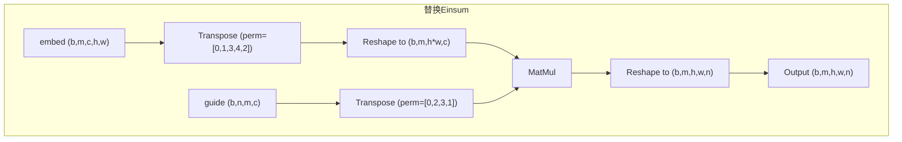

# One Line Description

规约操作合集

# 描述

核心是通过一个**字符串方程**来描述输入张量的维度如何组合、变换、相乘和求和，最终得到输出张量。

## 字符串方程格式

格式为 `输入下标 -> 输出下标`，例如 `"ij,jk->ik"`。

- `**>**` **左边**：描述一个或多个输入张量的维度。每个字母代表一个维度，用逗号分隔不同的输入张量。
- `**>**` **右边**：描述输出张量的维度。

## 核心规则

1. **求和/收缩 (Summation/Contraction)**：在**输入**中出现，但在**输出**中**没有**出现的字母，代表这些维度需要被求和（或“收缩”）。
2. **保留 (Preservation)**：在**输入**和**输出**中都出现的字母，代表这些维度被保留下来。它们在输出中的顺序决定了最终的维度排列。

# 常见用例

- **矩阵转置 (Transpose)**
    - 方程: `"ij->ji"`
    - 解释: 输入是一个2D张量，维度为 `i` 和 `j`。输出也是一个2D张量，但维度顺序换成了 `j` 和 `i`。
- **求和 (Summation)**
    - 沿特定轴求和: `"ij->i"` (对 `j` 轴求和)
    - 所有元素求和: `"ij->"` (对 `i` 和 `j` 轴都求和，输出一个标量)
- **矩阵乘法 (Matrix Multiplication)**
    - 方程: `"ij,jk->ik"`
    - 解释: 输入两个2D张量。第一个形状为 `(i, j)`，第二个为 `(j, k)`。`j` 维度在输入中出现，但在输出中没有，所以它被求和。最终输出形状为 `(i, k)`。
- **批量矩阵乘法 (Batch Matrix Multiplication)**
    - 方程: `"bij,bjk->bik"`
    - 解释: `b` 是批次维度，它在输入和输出中都存在，所以被保留。`j` 维度被求和。这会在批次维度上独立执行矩阵乘法。
- **点积 (Dot Product)**
    - 方程: `"i,i->"`
    - 解释: 输入两个1D向量，长度都为 `i`。`i` 维度被求和，输出一个标量。
- **提取对角线 (Extract Diagonal)**
    - 方程: `"ii->i"`
    - 解释: 输入一个2D方阵 `(i, i)`。只取 `i` 和 `j` 相同的元素，组成一个1D向量。

# 为什么引入这个算子？

- **简洁性 (Conciseness)**: 一个 `Einsum` 操作可以替代多个 `Transpose`, `MatMul`, `ReduceSum` 等操作的组合，让计算图更清晰。
- **可读性 (Readability)**: 对于熟悉它的人来说，方程本身就清晰地描述了张量的变换逻辑，比一步步的操作链更容易理解。
- **通用性 (Versatility)**: 它覆盖了绝大多数常见的张量代数运算。

# 实际例子


## 逐步分解

- **输入1 (**`**embed**`**)**: 维度为 `(b, m, c, h, w)`
    - `b`: Batch size (批次大小)
    - `m`: Modalities / Heads (模态或头的数量)
    - `c`: Channels (通道数)
    - `h`: Height (高度)
    - `w`: Width (宽度)
    - 从命名 `embed` 和维度 `(b, c, h, w)` 来看，这很可能是一个卷积网络输出的特征图（Feature Map）。
- **输入2 (**`**guide**`**)**: 维度为 `(b, n, m, c)`
    - `b`: Batch size (与输入1匹配)
    - `n`: Number of new features / tokens (新特征或令牌的数量)
    - `m`: Heads (与输入1匹配)
    - `c`: Channels (与输入1匹配)
    - 从命名 `guide` 来看，它可能是一个用于指导特征变换的“引导张量”或“注意力图”。
- **输出**: 维度为 `(b, m, h, w, n)`

## 核心规则分析

- **求和维度 (被“消除”的维度)** 我们找出在输入中出现、但在输出中**没有**出现的字母。
    - 输入字母: `b, m, c, h, w, n`
    - 输出字母: `b, m, h, w, n`
    - 对比发现，字母 `**c**` 在输入中存在，但在输出中消失了。
    - **结论**: `Einsum` 操作会对 `c` 这个维度进行**求和（Summation）或收缩（Contraction）**。这意味着它会沿着通道维度 `c` 对两个输入进行逐元素相乘，然后将结果累加起来。这本质上是一个**点积（Dot Product）**操作。
- **保留维度 (被“保留”的维度)** 所有在输入和输出中都存在的字母都会被保留下来。
    - `b` 和 `m` 在两个输入和输出中都存在，是批次和头的维度。
    - `h` 和 `w` 只在输入1中存在，并被保留到输出中，代表空间维度。
    - `n` 只在输入2中存在，并被保留到输出中，代表新的特征维度。

## 直接解释

对于批次中的每一项 (`b`) 和每一个头 (`m`)：

1. 我们有一个 `(c, h, w)` 的特征图 (`embed`)。
2. 我们还有一个 `(n, c)` 的引导矩阵 (`guide`)。
3. 操作的核心是，`guide` 矩阵告诉我们如何将 `embed` 特征图的 `c` 个通道线性组合成 `n` 个新的特征。
4. 对于 `embed` 特征图上的**每一个空间位置** `**(h, w)**`，它的 `c` 维通道向量都会与 `guide` 矩阵中的**每一行**（共 `n`行）进行点积运算。
5. 这样，对于一个 `(h, w)` 位置，经过计算后，它的特征就从原来的 `c` 维向量变成了新的 `n` 维向量。
6. 这个过程在所有空间位置 `(h, w)` 上重复，最终生成一个形状为 `(h, w, n)` 的新特征图。
7. 将 `b` 和 `m` 维度考虑回来，最终的输出形状就是 `(b, m, h, w, n)`。

**一句话总结：该操作使用** `**guide**` **张量作为权重，将** `**embed**` **特征图的通道** `**c**` **进行了重新线性组合，从** `**c**` **个旧通道映射到了** `**n**` **个新通道。**

## 伪代码形式

```Python
# embed.shape = (b, m, c, h, w)
# guide.shape = (b, n, m, c)
# output = np.zeros((b, m, h, w, n))

for b_idx in range(b):
    for m_idx in range(m):
        for h_idx in range(h):
            for w_idx in range(w):
                for n_idx in range(n):
                    # 以下是核心的点积操作，对 c 维度进行求和
                    sum_val = 0
                    for c_idx in range(c):
                        sum_val += embed[b_idx, m_idx, c_idx, h_idx, w_idx] * guide[b_idx, n_idx, m_idx, c_idx]
                    output[b_idx, m_idx, h_idx, w_idx, n_idx] = sum_val
```

## 等价算子替换

### 分析

- **目标**: 实现 `bmchw,bnmc -> bmhwn`
- **输入1 (**`**embed**`**)**: `A`, 形状为 `(b, m, c, h, w)`
- **输入2 (**`**guide**`**)**: `B`, 形状为 `(b, n, m, c)`

`MatMul` 算子通常对输入张量的最后两个维度进行矩阵乘法，而视前面的维度为批次（Batch）维度。标准的 `MatMul(X, Y)` 要求 `X` 的形状是 `(..., N, K)`，`Y` 的形状是 `(..., K, M)`，输出形状为 `(..., N, M)`。我们的目标就是把 `A` 和 `B` 变成这种形式。

### **第1步: 重排输入1 (**`**embed**`**)**

我们需要将 `c` 维度放到最后，并将 `h` 和 `w` 合并成一个维度，作为矩阵的“行”。

1. `**Transpose**` **(转置)**:
    - 原始维度: `(b, m, c, h, w)`
    - 目标排列: 将 `c` 移到最后，`h` `w` 移到 `c` 前面。排列为 `(b, m, h, w, c)`。
    - `perm` 参数: `[0, 1, 3, 4, 2]`
    - **输出形状**: `(b, m, h, w, c)`
2. `**Reshape**` **(重塑)**:
    - 将 `h` 和 `w` 两个空间维度合并成一个，以形成矩阵的“行”。
    - **目标形状**: `(b, m, h*w, c)`
    - **输出**: 得到准备好的 `A_prepared`，其形状为 `(b, m, h*w, c)`。

### **第2步: 重排输入2 (**`**guide**`**)**

我们需要将 `c` 维度放到倒数第二位，`n` 维度放到最后，以匹配 `MatMul` 的要求。

1. `**Transpose**` **(转置)**:
    - 原始维度: `(b, n, m, c)`
    - 目标排列: 将 `b` `m` 作为批次维度，`c` `n` 作为矩阵维度。排列为 `(b, m, c, n)`。
    - `perm` 参数: `[0, 2, 3, 1]`
    - **输出**: 得到准备好的 `B_prepared`，其形状为 `(b, m, c, n)`。

### **第3步: 核心计算 (**`**MatMul**`**)**

现在两个输入的形状已经完美匹配 `MatMul` 的要求。

- `**MatMul(A_prepared, B_prepared)**`:
    - `A_prepared` 形状: `(b, m, h*w, c)`
    - `B_prepared` 形状: `(b, m, c, n)`
    - 前面的 `(b, m)` 被视为批次维度。
    - 核心矩阵乘法是 `(h*w, c)` @ `(c, n)`。
    - **输出 (**`**C_temp**`**) 形状**: `(b, m, h*w, n)`

### **第4步: 重塑输出**

`MatMul` 的输出结果 `C_temp` 的维度顺序和我们最终想要的 `(b, m, h, w, n)` 还差一点，需要最后一次 `Reshape`。

1. `**Reshape**` **(重塑)**:
    - 将 `h*w` 这个维度重新拆分成 `h` 和 `w`。
    - **目标形状**: `(b, m, h, w, n)`
    - **最终输出**: 这就是我们想要的结果。

> 注意: 在进行最后一步 Reshape 时，如果 h 和 w 是动态的，你需要先用 Shape 算子从原始输入 embed中获取 h 和 w 的值，然后与 b, m, n 拼接成最终 Reshape 的目标形状张量。

