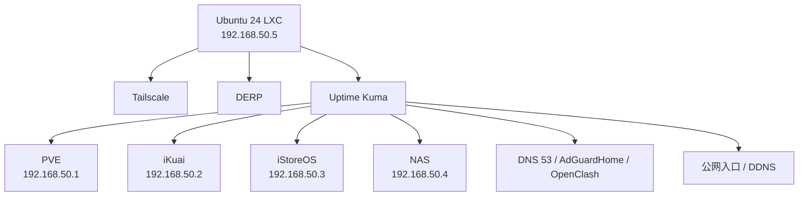

[[07-configure-tailscale-derp-guide|前一章]] 我们已经把 `192.168.50.5` 这台 `Ubuntu 24 LXC` 变成了：

- Tailscale 节点
- Subnet Router
- 自建 DERP 节点

但只做到这一步，整套家庭 AIO 还差最后一块非常现实的东西：

> **出了故障以后，你能不能在 1 分钟内判断到底哪一层挂了？**

如果不能，那每次出问题你还是只能靠猜。

所以这一章，我们不讲什么大而全的企业监控体系，而是做一套**真正适合家庭 AIO 的轻量分层告警**。

---

### 本章导读：1 分钟看懂最终落地方案

### 1. 监控平台放哪

直接放在上一章的：

- `Ubuntu 24 LXC`
- `192.168.50.5`

继续用这一台节点承接监控平台，理由非常简单：

- 它本来就是远程运维跳板
- 不和 `iStoreOS` 共生死
- 出问题时你还能通过 `Tailscale` 连回来

### 2. 本章最终你会做完什么

1. 在 `192.168.50.5` 上部署 `Uptime Kuma`
2. 给 `PVE / iKuai / iStoreOS / NAS / LXC` 建基础存活探针
3. 给 `AdGuardHome / OpenClash / DNS / DDNS / Tailscale` 建关键服务探针
4. 配一套足够克制、不容易误报的告警阈值
5. 配 Telegram / 邮件这类通知渠道

### 3. 本章核心原则

- **先监控关键路径，不要一上来监控一切**
- **先回答“谁挂了”，再考虑“为什么慢”**
- **监控平台不能和被监控对象深度绑定**

---

## 一、为什么家庭 AIO 也值得认真做监控

很多人一说“家庭监控”，第一反应就是：

- 家里又不是公司
- 有必要搞这么复杂吗

其实对于家庭 AIO，监控的价值反而非常实际。

因为家庭故障和机房故障最大的区别在于：

- 机房故障，你人就在电脑前
- 家庭故障，往往是你不在家

最典型的场景就是：

- 家里人突然跟你说“上不了网了”
- 你自己在公司、在高铁、在外地
- 你完全不知道是：
  - 宽带掉了
  - PVE 宿主机死了
  - iKuai 没起来
  - iStoreOS 挂了
  - 还是单纯 DNS 出了问题

如果没有监控，你每次都得从零开始猜。

所以这一章我们要做的，不是一个“炫技面板”，而是一套：

> **一看就知道故障大概在哪一层** 的家庭监控系统。

---

## 二、为什么这次选 Uptime Kuma，而不是一上来就 Prometheus

作为工程师，你当然可以直接上：

- Prometheus
- Grafana
- Exporter
- Loki

但实话实说，对目前这套家庭 AIO 来说，第一阶段真的没必要。

因为你最先需要解决的问题，不是：

- CPU 曲线漂不漂亮
- Dashboard 能不能炫

而是：

- 宿主机活着吗
- 主路由活着吗
- 旁路由活着吗
- DNS 活着吗
- 远程入口活着吗

这恰恰是 `Uptime Kuma` 最擅长的场景：

- 部署轻
- 探针类型足够用
- 页面直观
- 告警配置简单

所以这章的思路不是“最强监控”，而是：

> **先用最低复杂度把 80 分的可观测性做出来。**

---

## 三、为什么监控平台要继续放在 `192.168.50.5`

前一章已经把 `192.168.50.5` 定义成了远程运维跳板。

这一章继续沿用这个思路，有两个巨大好处。

### 1. 不和 iStoreOS 共生死

如果你把监控平台也放进 `iStoreOS`：

- 一旦旁路由本身挂了
- 监控也跟着一起挂了

你收到的不是告警，而是沉默。

### 2. 方便异地运维

因为 `192.168.50.5` 本身就已经有：

- Tailscale
- Subnet Router
- DERP

所以把 `Uptime Kuma` 放进去之后，你就得到了一台真正意义上的：

> **家庭基础设施运维节点**

```text
192.168.50.5
├── tailscaled
├── derper
├── Uptime Kuma
└── 后续可加少量轻量运维服务
```



---

## 四、先部署 Uptime Kuma

这一章我不建议你额外再建一台容器，直接沿用前一章的 `Ubuntu 24 LXC` 即可。

### 1. 先确认上一章的软件源已经切好

如果你完全跟着上一章来的，那么 `192.168.50.5` 这台 Ubuntu 24 LXC 应该已经：

- 备份过 `/etc/apt/sources.list`
- 切到了清华源

如果还没做，建议先补上这一步，再继续安装 `Uptime Kuma`。

### 2. 创建目录

```bash
mkdir -p /opt/uptime-kuma
cd /opt/uptime-kuma
```

### 3. 编写 `compose.yaml`

```bash
cat > /opt/uptime-kuma/compose.yaml <<'EOF'
services:
  uptime-kuma:
    image: louislam/uptime-kuma:1
    container_name: uptime-kuma
    restart: unless-stopped
    volumes:
      - ./data:/app/data
    security_opt:  
      - apparmor=unconfined
    dns:
      - 192.168.50.2
      - 223.5.5.5
    ports:
      - "3001:3001"
EOF
```

### 4. 启动

```bash
cd /opt/uptime-kuma
docker compose up -d
d compose ps
docker logs uptime-kuma --tail=50
```

如果这里卡在拉镜像，同样优先判断是不是 Docker Hub 访问速度问题，而不是 `apt` 源问题。

### 5. 首次访问

浏览器打开 [192.168.50.3:3001](http://192.168.50.5:3001)：

第一次会进入初始化页面，设置：

- 管理员用户名
- 管理员密码


---

## 五、第一批监控项到底该怎么选

这一节是整篇里最关键的实战部分。

很多人装好 Uptime Kuma 之后，第一反应是疯狂往里加项目。

这是非常典型的误区。

家庭环境里，更合理的做法是：

> **只盯关键路径。**

也就是说，只盯那些一旦挂了，你就真会立刻受影响的节点。

### 1. 第一层：骨架健康检查

先加这五个最基础的存活探针。

#### `LAN - PVE Host`

- 类型：`Ping`
- 目标：`192.168.50.1`

作用：

- 判断宿主机是否在线


> 设置通知的地方可以设置 telegram bot 进行通知


#### `LAN - iKuai`

- 类型：`Ping`
- 目标：`192.168.50.2`

作用：

- 判断主路由是否在线


#### `LAN - iStoreOS`

- 类型：`Ping`
- 目标：`192.168.50.3`

作用：

- 判断旁路由整体是否在线

#### `LAN - NAS`

- 类型：`Ping`
- 目标：`192.168.50.4`

作用：

- 判断存储节点是否在线

#### `LAN - Home LXC Ubuntu`

- 类型：`Ping`
- 目标：`192.168.50.5`

作用：

- 判断远程运维跳板是否在线

这五个点，是整套 AIO 的“骨架监控”。


---

## 六、第二层：关键服务探针

骨架节点能 Ping 通，并不代表服务真的在工作。

所以第二层，我们只加少量“应用层探针”。

### 1. `AdGuardHome`

#### `LAN - AdGuardHome UI`

- 类型：`HTTP(s)`
- 目标：`http://192.168.50.3:3000`

作用：

- 判断 AGH 管理面是否还活着


### 2. `OpenClash`

#### `LAN - OpenClash Controller`

- 类型：`TCP Port`
- 目标：`192.168.50.3:9090`

作用：

- 判断 OpenClash 控制面是否还在监听

### 3. 家庭 DNS 入口

#### `LAN - DNS 53`

- 类型：`Port`
- 目标：`192.168.50.3:53`

作用：

- 判断家庭 DNS 入口是否还活着

注意这里我们第一版故意不做太复杂的 DNS 查询脚本，就是为了降低维护成本。

---

## 七、第三层：远程入口探针

如果你真的关心“异地回家”，那就不能只监控局域网。

还要监控两类入口。

### 1. `Tailscale` 入口

#### `Remote - Tailscale Entry`

- 类型：`Ping`
- 目标：`192.168.50.5` 对应的 `100.x.x.x`

作用：

- 判断 tailnet 侧入口是否正常

### 2. 公网入口

#### `WAN - Public DDNS`

- 类型：`HTTP(s)` 或 `Ping`
- 目标：你的公网入口地址

这里有一个现实情况：

你上一章已经选择的是 **IP 方式的 DERP**，并不想把服务描述成一个固定域名。

所以这一项有两种做法：

#### 做法 A：监控当前公网 IP

你可以直接监控：

- 当前脚本探测出来的公网 IP

缺点是：

- 每次 IP 变化后，要一起更新监控项目标

#### 做法 B：保留一个只用于 DDNS 解析的轻量域名

即便你不把它公开当服务名，也可以只把它当“监控和解析辅助入口”。

如果你非常介意域名，也可以先不加这项，等后面自己决定。

---

## 八、告警阈值怎么设才不烦人

家庭监控最怕的不是“太少”，而是“太吵”。

如果你把阈值设得过于敏感，最后结果一定是：

> 手机天天响，最后你对告警产生免疫。

第一版我推荐这样设：

- **检查间隔**：`30s` 或 `60s`
- **超时**：`5s`
- **重试次数**：`3`
- **恢复通知**：开启

这套参数的含义是：

- 一两次偶发波动不立刻吵你
- 连续失败才真正告警
- 服务恢复后，你也能收到“恢复了”的消息

---

## 九、通知渠道怎么配更务实

别追求“通知渠道多就是专业”，对家庭环境来说最重要的是：

> **你一定会看到。**

### 1. 推荐的主通知

选一个你平时一定会看的：

- Telegram Bot
- 企业微信机器人
- 邮件

### 2. 再加一个兜底通知

例如：

- 邮件
- 另一个机器人

这样做的意义是：

- 主渠道偶发抽风时
- 你至少还有第二条路


下拉可以选择不同的通知类型：


因为这台机器是不会配置出海软件的（懒得配置），路由也没有指向 iStore，所以没有出海的条件，所以选择飞书通知

先勾选 **默认开启** 和 **应用到所有现有监控项**


接下来去获取 `WebHoook URL`，打开个人飞书，点击 `+` 创建群聊，不用选择任何人，创建单人群


点击 `...` 选择 **群机器人**


点击添加机器人，选择自定义机器人


给机器人取名 **Uptime Kuma 通知**，点击添加


点击复制 Webhook 地址（点击完成时出现弹窗告警，忽略，保管好地址即可）


粘贴到刚才的 kuma 处


测试的消息，故意把 openclash controller 的 port 改成错误的，再改回来，机器人发送了如下信息


---

## 十、这套监控到底怎么读

监控真正的价值，不在于界面好看，而在于你收到故障以后能快速定位。

### 1. 如果 `LAN - PVE Host` 离线

优先怀疑：

- AIO 断电
- PVE 宿主机宕机
- 宿主机网络配置损坏

### 2. 如果 `LAN - iKuai` 离线，但 `PVE Host` 在线

优先怀疑：

- iKuai VM 挂了
- iKuai 没自启动
- 虚拟网卡问题

### 3. 如果 `LAN - iStoreOS` 离线，但 `iKuai` 在线

优先怀疑：

- iStoreOS VM 挂了
- 旁路由没启动
- bridge 或虚拟网卡有问题

### 4. 如果 `iStoreOS` 在线，但 `DNS 53` 挂了

优先怀疑：

- AGH 进程问题
- DNS 监听冲突
- 旁路系统活着，但服务层坏了

### 5. 如果 `192.168.50.5` 在线，但 `Remote - Tailscale Entry` 异常

优先怀疑：

- Tailscale 自身掉线
- tailnet 登录状态异常
- 路由宣告有问题

这就是为什么我们强调：

> **分层探针，比堆一堆漂亮图表更重要。**

---

## 十一、本章小结

这一章做完之后，你得到的不是一个“看起来像监控”的面板，而是一套真正有用的家庭告警系统。

它至少能帮你做到：

1. 快速判断宿主机还在不在
2. 快速判断主路由、旁路由、NAS、远程跳板哪一层坏了
3. 在你不在家的时候，减少纯靠猜来排障

而且最重要的是：

它继续沿用了前一章的设计思路，把 `192.168.50.5` 打造成统一的远程运维节点。

下一章，我们就讲这套系统最后一块最关键的内容：

> **备份、恢复与换机迁移。**
