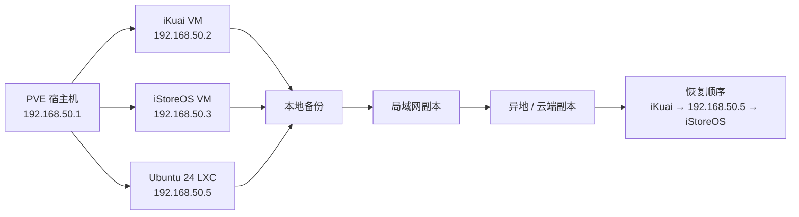

到这一章，前面的 AIO 基本已经搭得差不多了：

- PVE 有了
- iKuai 有了
- iStoreOS 有了
- NAS 有了
- `192.168.50.5` 的 Tailscale / DERP / 监控也有了

很多人做到这里，就会自然产生一种错觉：

> 这套系统已经“稳了”。

其实还没有。

因为真正决定一套系统稳不稳的，不只是“平时能不能跑”，而是：

> **出了故障以后，你能不能在较短时间内恢复。**

这一章，我们就把恢复能力补完整。

---

### 本章导读：1 分钟看懂最终落地方案

### 1. 这一章真正要解决的问题

不是“怎么做一个备份文件”，而是：

- `iStoreOS` 插件玩崩了怎么救
- `Ubuntu 24 LXC` 配坏了怎么救
- PVE 宿主机硬盘坏了怎么救
- 甚至整台 AIO 换新主机时怎么迁移

### 2. 本章最终结论

家庭 AIO 最稳的方案，至少分成三层：

1. **PVE 整机备份**
2. **关键服务配置备份**
3. **恢复手册**

### 3. 当前这一套里必须重点照顾的节点

| 角色 | 形式 | IP 地址 | 备注 |
|---|---|---|---|
| PVE 宿主机 | 物理机 | `192.168.50.1` | 全部实例底座 |
| iKuai | VM | `192.168.50.2` | 主路由，决定基础网络 |
| iStoreOS | VM | `192.168.50.3` | OpenClash、AdGuardHome |
| NAS | VM | `192.168.50.4` | 家庭数据中心 |
| Ubuntu 24 LXC | LXC | `192.168.50.5` | Tailscale、DERP、监控 |

---

## 一、为什么“能搭起来”不等于“这套系统稳”

很多家庭 AIO 的真实问题，不在于搭建，而在于：

- 平时跑得好好的
- 一出故障就只能重装

而重装带来的成本远比你想象的大：

- 地址规划要回忆
- 虚拟机顺序要回忆
- 网桥和网卡映射要回忆
- 端口映射、静态分配、特殊设备策略都要重配

一旦没有备份，或者只有一份“孤零零的压缩包”，整个恢复过程最后会演变成：

> “从头再搭一遍，而且不一定搭得回原来那样。”

所以这篇文章的重点，不是“备份按钮在哪”，而是：

> **怎么把这套系统的恢复能力做成工程化流程。**



---

## 二、为什么家庭 AIO 至少要做三层备份

只做一种备份，通常都不够。

### 1. 第一层：PVE 整机备份

这一层解决的是：

- 某个 VM / LXC 配坏了
- 想快速回滚到之前的稳定状态

例如：

- `iKuai`
- `iStoreOS`
- `Ubuntu 24 LXC`

这类节点最适合做 PVE 层面的整机备份。

### 2. 第二层：服务级配置备份

这一层解决的是：

- 换主机迁移
- 局部重建
- 不想整机回滚，只想恢复某个服务配置

例如：

- `iStoreOS` 的 `/etc/openclash/`
- `/etc/AdGuardHome.yaml`
- `192.168.50.5` 上的 `/opt/derper/compose.yaml`
- `/opt/derper/scripts/update-public-ip.sh`
- `Uptime Kuma` 的数据目录
- `router_config.bak`

### 3. 第三层：恢复手册

这是最容易被忽略、但在紧急情况下最值钱的一层。

很多人真正缺的不是“备份文件”，而是：

- 不记得哪个 VMID 是谁
- 不记得网桥叫什么
- 不记得 `.2`、`.3`、`.5` 分别对应什么角色

所以第三层的作用就是：

> **让你在出故障时不用先靠脑子回忆。**

---

## 三、当前这套 AIO 里，哪些东西必须备

如果你完全沿用本系列 01-08 的规划，那么至少要覆盖下面这些对象。

### 1. PVE 宿主机

至少记录或备份：

- PVE 管理地址
- bridge 名称，例如 `vmbr0`
- 宿主机物理网卡名
- 存储池信息
- VM / LXC 的 ID 和角色对应关系

### 2. `iKuai VM（192.168.50.2）`

必须保留：

- 整机备份
- 导出的配置文件
- DHCP 静态分配
- 特殊设备网关 / DNS 策略
- 端口映射
- DDNS
- 静态路由

这是最容易被低估的节点。

因为它不仅是一个服务，它还是你整个家庭基础网络的门槛。

### 3. `iStoreOS VM（192.168.50.3）`

必须保留：

- 整机备份
- OpenWrt / iStoreOS 系统备份
- `/etc/openclash/`
- `/etc/AdGuardHome.yaml`

### 4. `NAS VM（192.168.50.4）`

必须保留：

- 系统盘备份策略
- 数据盘规划说明
- 存储池结构说明

### 5. `Ubuntu 24 LXC（192.168.50.5）`

必须保留：

- 整个 LXC 备份
- `Tailscale` 配置说明
- `DERP` 目录 `/opt/derper`
- `Uptime Kuma` 目录 `/opt/uptime-kuma`
- 自定义脚本
- `systemd` 和 `cron`

---

## 四、备份频率怎么设更像工程方案

家庭环境没必要照搬企业级策略，但也不能太随缘。

我建议从下面这套开始：

| 备份类型       | 频率      | 适用对象                                      | 目的        |
| ---------- | ------- | ----------------------------------------- | --------- |
| PVE 整机备份   | 每周 1 次  | `iKuai`、`iStoreOS`、`Ubuntu LXC`           | 快速回滚      |
| 关键配置导出     | 每天 1 次  | OpenClash、AdGuardHome、DERP、Tailscale、自写脚本 | 细粒度恢复     |
| 手动快照       | 重大升级前   | OpenClash、系统升级前                           | 保底        |
| iKuai 配置导出 | 每次改完策略后 | iKuai                                     | 防止主路由规则丢失 |

最关键的一条是：

> **任何会影响全家基础网络的动作，都值得在动手前多做一份快照。**

---

## 五、PVE 整机备份怎么做

这一节讲的是最务实、最省脑子的第一层备份。

### 1. 哪些实例一定要进备份作业

建议至少把下面三个放进固定作业：

- `iKuai VM`
- `iStoreOS VM`
- `Ubuntu 24 LXC`

如果你后面的 NAS 也是高频改动节点，也建议纳入。

### 2. 备份模式怎么选

PVE 常见有三种模式：

- `Snapshot`
- `Suspend`
- `Stop`

家庭环境里，推荐优先级通常是：

1. `Snapshot`
2. `Suspend`
3. `Stop`

如果你的底层存储不支持很好用的快照，直接用夜间 `Stop` 备份也可以，简单但稳。

### 3. 在 PVE Web 界面里创建备份作业

路径：

- `Datacenter -> Backup -> Add`

建议参数：

- **General**：
	- **Node**：你的 PVE 节点
	- **Storage**：备份目标存储，一半选择 local 即可
	- **Selection mode**：Include selected VMs
	- **VMs**：勾选 `iKuai / iStoreOS / Ubuntu LXC`
	- **Schedule**：例如每周一次凌晨 3 点 `mon 03:00`
	- **Mode**：优先 `Snapshot`
	- **Compression**：ZSTD
	- **Job Comment**：全量备份
- **Retention** 备份策略：
	- **Keep Last**：3 个，防止硬盘被塞满
- **其他选项保持默认即可**


### 4. 备份命名习惯

建议你的角色命名尽量清楚，比如：

```text
100  ikuai-gateway
101  istoreos-router
102  nas-storage
105  home-tailnet
```

这样以后看备份文件，不会只看到一串 ID 发懵。

---

## 六、服务级配置备份操作手册

整机备份解决的是“大回滚”，服务级备份解决的是“细恢复”和“换机迁移”。

这一节不再只讲原则，而是直接按你这套机器的真实结构来操作。

### 1. 先明确：这一层到底备什么

这一层不追求“整个机器原样回滚”，而是追求：

- 单独恢复某个服务
- 换主机后尽快把关键配置补回去
- 不依赖整机备份也能把核心行为恢复出来

所以这里备的应该是：

- 配置文件
- 数据目录
- 自定义脚本
- 定时任务
- 后台手工点出来的配置导出文件

反过来说，这一层**不建议**把下面这些运行时目录当重点：

- Docker 镜像缓存
- `containerd` 运行时状态
- 临时日志

它们占空间、变化快、恢复价值低，真的重建时重新拉就行。

### 2. `iStoreOS`：先用系统自带备份，再单独记住关键目录

你这套里，`iStoreOS` 最值钱的不是“系统能开机”，而是：

- `OpenClash`
- `AdGuardHome`
- `/etc/config/` 里的网络和服务配置

你现在这台 `iStoreOS` 上，关键路径已经很明确了：

```bash
root@iStoreOS:/etc# ls /etc/ | grep -i -E "config|openclash|adguard"
AdGuardHome.yaml
config
netconfig
openclash
```

所以这台机器至少要覆盖：

- `/etc/config/`
- `/etc/openclash/`
- `/etc/AdGuardHome.yaml`

#### 备份步骤

进入：

- `系统 -> 备份与更新`

这一步在你现在这台机器上很简单：

1. 进入 `系统 -> 备份与更新`
2. 点击 `生成备份`
3. 等浏览器下载完成
4. 把这个 `tar` 备份另存到别处


建议至少放三处：

- 本地电脑一份
- NAS 一份
- 异地同步目录一份

这份系统备份主要解决：

- OpenWrt / iStoreOS 自身配置恢复
- `/etc/config/` 这一类系统级配置恢复

#### 恢复时怎么用

如果以后只是：

- `OpenClash` 配坏了
- `AdGuardHome` 配坏了
- 或者某次系统改动把配置弄乱了

优先还是回到这页，用导出的备份包做恢复。

如果是整机恢复以后再补配置，也建议先恢复这份系统备份，再去核对下面几个关键路径是不是都回来了：

- `/etc/config/`
- `/etc/openclash/`
- `/etc/AdGuardHome.yaml`

### 3. `Ubuntu 24 LXC（192.168.50.5）`：备配置目录，不备运行时垃圾

你这台 `home-tailnet` 上现在的 `/opt` 很清楚：

```bash
root@home-tailnet:~# ls /opt/
containerd  derper  uptime-kuma
```

这里真正值得备的是：

- `/opt/derper`
- `/opt/uptime-kuma`

而不建议把 `/opt/containerd` 当成重点恢复对象。  
原因很简单：

- `containerd` 更像运行时缓存和状态目录
- 真要重建，Docker/容器重新拉起来就会再生成
- 备它只会让包更大、恢复更乱

#### 还要一起保留的内容

除了这两个目录，别漏掉：

- root 的 `crontab`
- 如果你有自定义 systemd unit，也一起导出
- 这台机器上的环境说明，例如：
  - Tailscale 是否开启 `--accept-dns=false`
  - 是否开启 `accept-routes`
  - 是否承担 `Subnet Router`

#### 备份步骤

在 `home-tailnet` 上执行：

```bash
mkdir -p /root/backup

tar czvf /root/backup/home-tailnet-derper-uptime-$(date +%F).tar.gz \
  /opt/derper \
  /opt/uptime-kuma

crontab -l > /root/backup/home-tailnet-crontab-$(date +%F).txt
```

执行完成后，立刻检查一下结果：

```bash
ls -lh /root/backup
```

正常情况下，你至少应该看到：

- 一份 `home-tailnet-derper-uptime-YYYY-MM-DD.tar.gz`
- 一份 `home-tailnet-crontab-YYYY-MM-DD.txt`

如果你后面有自定义 systemd 服务，再补一份：

```bash
systemctl list-unit-files --type=service | grep -E 'derper|uptime|tailscale'
```

必要时把对应 unit 文件一起备出来。

#### 恢复时怎么用

如果以后 `192.168.50.5` 需要重建，最常见的顺序是：

1. 先新建一台同地址的 `Ubuntu 24 LXC`
2. 重新装好基础依赖，例如 `docker`、`tailscale`
3. 把备份文件传回去
4. 解压回 `/`
5. 恢复 root 的 `crontab`
6. 再启动 `derper` 和 `uptime-kuma`

恢复命令可以直接写成：

```bash
tar xzvf /root/backup/home-tailnet-derper-uptime-YYYY-MM-DD.tar.gz -C /
crontab /root/backup/home-tailnet-crontab-YYYY-MM-DD.txt
```

恢复完以后，优先检查三件事：

- `/opt/derper` 在不在
- `/opt/uptime-kuma` 在不在
- `crontab -l` 是否已经恢复

#### 这一层为什么够用

因为对 `192.168.50.5` 来说，真正决定行为的是：

- `compose.yaml`
- `.env`
- `certs`
- `scripts`
- `Uptime Kuma` 数据目录
- `crontab`

这些都在 `/opt/derper`、`/opt/uptime-kuma` 和 root 的计划任务里。

### 4. `iKuai`：一定要把“会影响全家网络行为”的配置导出来

`iKuai` 最容易让人误判。

很多人以为：

- 只要主路由系统盘还在
- 恢复时把 VM 拉起来就行

其实对 `iKuai` 来说，最值钱的往往不是“系统本身”，而是你后来一点点调出来的这些策略：

- DHCP 静态分配
- 特殊设备网关 / DNS
- 端口映射
- DDNS
- 静态路由
- NAT 规则

这些才决定“全家网络最终怎么表现”。

#### 备份步骤

进入：

- `系统设置 -> 升级备份 -> 系统备份 -> 导出当前配置`


备份会自动下载到访问此页面的电脑上

这页里最关键的是四个按钮：

- `导出当前配置`
- `备份当前配置`
- `恢复默认配置`
- `恢复出厂设置`

对日常备份来说，你主要用前两个：

1. `导出当前配置`
   - 直接把配置导出到你的电脑
   - 这是最适合离机保存的一份

2. `备份当前配置`
   - 更像在路由器本机保留一份
   - 适合短期回滚

我的建议是：

- 每次做完重要改动后，优先点一次 `导出当前配置`
- 如果刚改完一批规则，想在本机留一个短期回滚点，再点一次 `备份当前配置`
- 再把导出的文件同步到 NAS 和异地目录

#### `导出当前配置` 和 `备份当前配置` 的区别

这个页面最容易让人混淆的就是这两个按钮。

你可以直接这样理解：

- `导出当前配置`
  - 重点是“拿到电脑上”
  - 适合长期保存、离机保存、换机恢复
- `备份当前配置`
  - 重点是“留在 iKuai 自己身上”
  - 适合短期回滚

所以真正做长期备份时，优先级一定是：

1. `导出当前配置`
2. 再把导出的文件复制到别处

#### 恢复时怎么用

如果以后只是：

- 某次 DHCP / NAT / 路由 调坏了
- 但这台 `iKuai VM` 还在

那优先从这个页面上传之前导出的 `router_config.bak` 恢复。

如果是整机回滚或新主机重建后恢复 `iKuai`，也建议在恢复完成后手工核对一遍下面这些核心行为：

- DHCP 静态分配
- 特殊设备网关 / DNS
- 端口映射
- DDNS
- 静态路由
- NAT 规则

#### 哪些改动后一定要重新导出

只要你动过下面任意一项，都值得重新导一次：

- DHCP 静态分配
- 特殊设备网关 / DNS
- `OpenClash / DERP` 相关端口映射
- DDNS
- 静态路由
- NAT 规则

### 5. 这一层的最终交付物应该长什么样

做到这里后，你手里最好至少有下面这些文件：

- 一份 `iStoreOS` 页面导出的系统备份包 `backup-iStoreOS-YYYY-MM-DD.tar.gz`
- 一份 `iKuai` 导出的配置文件 `router_config.bak`
- 一份 `home-tailnet-derper-uptime-YYYY-MM-DD.tar.gz`
- 一份 `home-tailnet-crontab-YYYY-MM-DD.txt`


如果这些文件已经分别放到了：

- **本地电脑**
- **NAS**
- **异地同步目录**

那这一层服务级配置备份才算真正闭环。

如果你想把这部分整理得更规整，可以单独建一个目录：

```text
service-backup/
├── ikuai/
│   └── ikuai-config-YYYY-MM-DD.bin
├── istoreos/
│   └── istoreos-backup-YYYY-MM-DD.tar.gz
└── home-tailnet/
    ├── home-tailnet-derper-uptime-YYYY-MM-DD.tar.gz
    └── home-tailnet-crontab-YYYY-MM-DD.txt
```

---

## 七、备份应该放哪里：别只留在 PVE 本地

很多人第一次做备份，喜欢把所有备份都存在宿主机本地盘里。

这不是完整方案。

更稳的思路是轻量版 `3-2-1`：

### 1. 第一份：PVE 本地

作用：

- 恢复最快
- 回滚最直接

### 2. 第二份：局域网另一台设备

例如：

- NAS
- 另一台 Linux 主机
- 独立存储盘

作用：

- 防止宿主机磁盘一起坏

### 3. 第三份：异地或云端

例如：

- 远端 Linux 机器
- 对象存储
- 可靠的同步目录

作用：

- 防止整屋断电
- 防止宿主机和本地备份一起没
- 防止误删以后无处可回

---

## 八、原机恢复和换机恢复，根本不是一回事

这一步必须单独强调。

很多教程一句“从备份恢复”就带过去了，但实际差异非常大。

### 1. 原机恢复

典型场景：

- 某个 VM 配坏了
- 某个 LXC 升级翻车了
- 宿主机还活着，只是实例坏了

这种情况最适合：

- 直接整机回滚
- 或恢复到新 ID 后验证

### 2. 换机恢复

典型场景：

- 宿主机硬盘坏了
- 小主机直接挂了
- 整台 AIO 换成新设备

这时最大的问题往往不是“有没有备份”，而是：

- `vmbr0` 还叫不叫 `vmbr0`
- 宿主机物理网卡名字还一不一样
- 虚拟网卡顺序有没有变化
- MAC 地址变没变

这些变量一变，你的“恢复成功”很可能只是“开机成功”，不等于“网络真的恢复了”。

---

## 九、换机恢复时最容易踩的四个坑

### 1. bridge 名变化

旧宿主机是：

```text
vmbr0
```

新宿主机如果变成：

```text
vmbr1
```

而你的 VM / LXC 还引用旧 bridge，网络会直接不通。

### 2. 宿主机网卡名变化

旧机器可能是：

```text
eno1
```

新机器可能变成：

```text
enp2s0
```

如果你之前有脚本或手工配置依赖这些名字，迁移后就可能失效。

### 3. MAC 地址变化

这点对：

- iKuai
- iStoreOS
- Ubuntu LXC

尤其危险，因为很多 DHCP 静态分配和识别策略都和 MAC 相关。

### 4. 地址和角色说明丢失

如果你忘了：

- `.2` 是 iKuai
- `.3` 是 iStoreOS
- `.5` 是远程入口

恢复时就会非常痛苦。

---

## 十、我推荐的恢复顺序

这一节必须结合我们这套真实架构来讲：

```text
192.168.50.1  PVE
192.168.50.2  iKuai
192.168.50.3  iStoreOS
192.168.50.4  NAS
192.168.50.5  Ubuntu 24 LXC
```

### 1. 原机恢复顺序

如果宿主机本身还活着：

1. 先确认 `iKuai` 是否正常
2. 如果 `iKuai` 正常，再恢复 `192.168.50.5`
3. 确认 `Tailscale / DERP / 监控` 恢复
4. 再恢复 `iStoreOS`
5. 最后恢复其它附加业务

为什么这么排？

因为在这套架构里：

- `iKuai` 决定基础网络
- `192.168.50.5` 决定远程运维入口
- `iStoreOS` 决定增强功能

### 2. 换机恢复顺序

如果是整台宿主机换掉：

1. 安装新 PVE
2. 先恢复宿主机网络和 bridge
3. 恢复 `iKuai`
4. 验证默认网关、DHCP、基础出网
5. 恢复 `192.168.50.5`
6. 验证 `Tailscale / DERP / Uptime Kuma`
7. 再恢复 `iStoreOS`
8. 最后恢复附加业务

这套顺序的本质，是：

> **先恢复地基，再恢复远程入口，最后恢复增强功能。**

---

## 十一、恢复完成后必须检查什么

恢复绝不是“能开机”就结束了。

真正有价值的是逐层验收。最稳的方式不是“凭感觉试一下”，而是按角色逐项打勾。

下面这份清单可以直接作为你恢复后的验收顺序。

### 1. 宿主机层：先确认地基没问题

先看最底层的 `PVE 192.168.50.1`。

验收重点：

- [ ] PVE 管理页面能正常打开
- [ ] `vmbr0` 还在，而且实例都还挂在正确的 bridge 上
- [ ] 宿主机本身能出网
- [ ] VM / LXC 的启动顺序没有明显异常

你至少要确认：

- [ ] `192.168.50.1` 能从浏览器打开
- [ ] `iKuai / iStoreOS / Ubuntu 24 LXC` 都已经成功拉起
- [ ] 宿主机网络没有因为换机导致 bridge 名、物理网卡名变化而失效

如果这一层没过，后面所有节点看起来都会像“自己坏了”，其实只是底座没恢复完整。

### 2. `iKuai（192.168.50.2）`：先确认基础网络回来

`iKuai` 是全家基础网络的门槛，必须最先验收。

验收重点：

- [ ] IP 仍然是 `192.168.50.2`
- [ ] DHCP 能正常发地址
- [ ] DHCP 静态分配还在
- [ ] 默认出网正常
- [ ] 端口映射、静态路由、DDNS、NAT 规则没有丢

恢复后至少做这几件事：

- [ ] 打开 `192.168.50.2` 后台确认能登录
- [ ] 随便找一台普通设备重新连一次网，确认 DHCP 正常
- [ ] 到 `DHCP静态分配` 页面看关键设备记录还在不在
- [ ] 到 `端口映射`、`静态路由`、`DDNS` 页面各扫一遍

通过标准很简单：

- [ ] 普通设备不用旁路也能上网
- [ ] `192.168.50.2` 还是全家的默认网关
- [ ] 你之前依赖的关键转发和策略还在

### 3. `Ubuntu 24 LXC（192.168.50.5）`：再确认远程入口回来

这台机器是远程运维入口，验收时要重点看“网络角色”有没有恢复正确，而不只是服务进程在不在。

验收重点：

- [ ] 地址仍然是 `192.168.50.5`
- [ ] 默认网关仍然是 `192.168.50.2`
- [ ] `Tailscale` 在线
- [ ] `DERP` 容器正常
- [ ] `Uptime Kuma` 正常

恢复后建议至少执行：

```bash
ip route
tailscale status
docker ps
ls /opt/
```

你应该重点确认：

- [ ] 默认路由走的是 `192.168.50.2`，不是 `192.168.50.3`
- [ ] `/opt/derper`、`/opt/uptime-kuma` 都还在
- [ ] `derper` 容器已经起来
- [ ] `tailscale status` 能看到节点在线

如果你是异地恢复，这一层过关的标志就是：

- [ ] 你已经可以再次通过 `Tailscale` 管理家里
- [ ] `DERP` 和监控都恢复工作

### 4. `iStoreOS（192.168.50.3）`：最后确认增强功能恢复

`iStoreOS` 在这套架构里是增强层，不是地基层，所以放在 `iKuai` 和 `192.168.50.5` 后面验收最稳。

验收重点：

- [ ] IP 仍然是 `192.168.50.3`
- [ ] DHCP 仍然关闭
- [ ] `AdGuardHome` 正常
- [ ] `OpenClash` 正常
- [ ] 旁路由策略仍然符合预期

恢复后建议核对：

- [ ] `192.168.50.3` 后台能打开
- [ ] `系统 -> 备份与更新` 的恢复是否成功
- [ ] `OpenClash` 配置和订阅是否还在
- [ ] `AdGuardHome` 是否还能正常监听和工作
- [ ] `iStoreOS` 没有误开 DHCP，避免和 `iKuai` 打架

这层过关的标准不是“插件图标还在”，而是：

- [ ] `OpenClash` 真能跑
- [ ] `AdGuardHome` 真能解析
- [ ] 旁路由没有抢主路由工作

### 5. 家庭网络层：最后做整体验收

前面四层都正常后，最后才看全家实际使用体验。

这一层建议直接按“普通设备、特殊设备、家人兜底”三类来验收。

#### 普通设备

验收重点：

- [ ] 不经过旁路由也能上网
- [ ] 能正常访问国内常用网站
- [ ] DHCP 和 DNS 没有明显异常

#### 特殊设备

验收重点：

- [ ] 仍然拿到预期的网关 / DNS
- [ ] 旁路由策略符合你原来的设计
- [ ] 需要走 `OpenClash` 的设备能正常工作

#### 家人兜底

验收重点：

- [ ] 如果旁路由临时挂掉，家人仍有切回普通模式的路径
- [ ] 你文档里那套“普通模式 / 特殊模式”切换策略仍然成立

最后如果下面三件事都成立，这次恢复就算真正通过：

- [ ] 普通设备上网正常
- [ ] 特殊设备策略正常
- [ ] 远程入口和本地增强功能都恢复了

---

## 十二、恢复手册

下面这份就是我建议你长期保存的恢复手册正文。

它不是写给“平时看的”，而是写给“宿主机坏了、某个 VM 挂了、你人在外面又得赶紧恢复”的那个时刻看的。

你可以把它单独抄到一篇便签里，也可以直接保留在这篇文章最后。

### 1. 当前拓扑

- `PVE 宿主机`：`192.168.50.1`
- `bridge`：`vmbr0`
- `物理网口`：`nic0`、`nic2`、`nic3`
- `iKuai VM`：`192.168.50.2`
- `iStoreOS VM`：`192.168.50.3`
- `NAS VM`：`192.168.50.4`
- `Ubuntu 24 LXC`：`192.168.50.5`

`nic2` 和 `nic3` 是后来添加的，目的两个物理网口和原本的 LAN 口 `nic0` 绑定到同一个“虚拟交换机”（Linux Bridge）里，然后把这个整体作为一个通道丢给 iKuai。双击 `vmbro` 输入多个 port 时使用空格隔开


角色说明：

- `192.168.50.2`：主路由
- `192.168.50.3`：旁路由（`OpenClash / AdGuardHome`）
- `192.168.50.5`：远程运维入口（`Tailscale / DERP / Uptime Kuma`）

### 2. 关键原则

- `iKuai` 是基础网络，优先恢复
- `192.168.50.5` 是远程入口，第二优先恢复
- `iStoreOS` 是增强层，最后恢复
- `192.168.50.5` 的默认网关必须是 `192.168.50.2`，不能指向 `192.168.50.3`
- `iStoreOS` 仍然保持 `DHCP` 关闭，避免和 `iKuai` 冲突

### 3. 平时应该已经准备好的备份文件

PVE 整机备份至少要覆盖：

- `iKuai VM`
- `iStoreOS VM`
- `Ubuntu 24 LXC`

服务级配置备份至少要准备好这些文件：

- `router_config.bak`
- `backup-iStoreOS-YYYY-MM-DD.tar.gz`
- `home-tailnet-derper-uptime-YYYY-MM-DD.tar.gz`
- `home-tailnet-crontab-YYYY-MM-DD.txt`

### 4. 原机恢复顺序

适用场景：

- 宿主机还在
- 只是某个 VM / LXC 配坏了
- 或者某次升级翻车

恢复顺序：

1. 先确认 `PVE 192.168.50.1` 正常
2. 先恢复 `iKuai 192.168.50.2`
3. 再恢复 `Ubuntu 24 LXC 192.168.50.5`
4. 最后恢复 `iStoreOS 192.168.50.3`

原因：

- `iKuai` 决定全家的基础出网
- `192.168.50.5` 决定远程运维能不能接回来
- `iStoreOS` 决定增强功能，不应该抢在前面

### 5. 换机恢复顺序

适用场景：

- 小主机坏了
- 宿主机硬盘坏了
- 整台 AIO 换新主机

恢复顺序：

1. 重装 `PVE`
2. 先恢复宿主机网络和 `vmbr0`
3. 恢复 `iKuai`
4. 验证 DHCP、基础出网、默认网关
5. 恢复 `192.168.50.5`
6. 验证 `Tailscale / DERP / Uptime Kuma`
7. 恢复 `iStoreOS`
8. 最后恢复 NAS 和其他附加业务

### 6. 各节点恢复重点

#### `iKuai（192.168.50.2）`

恢复后优先确认：

- DHCP 静态分配还在
- 特殊设备网关 / DNS 策略还在
- 端口映射还在
- DDNS 还在
- 静态路由和 NAT 规则还在

#### `Ubuntu 24 LXC（192.168.50.5）`

恢复后优先确认：

- IP 仍然是 `192.168.50.5`
- 默认网关仍然是 `192.168.50.2`
- `/opt/derper` 在
- `/opt/uptime-kuma` 在
- `tailscale status` 正常
- `derper` 容器正常
- `Uptime Kuma` 正常

如果是用服务级备份恢复，可以执行：

```bash
tar xzvf /root/backup/home-tailnet-derper-uptime-YYYY-MM-DD.tar.gz -C /
crontab /root/backup/home-tailnet-crontab-YYYY-MM-DD.txt
```

#### `iStoreOS（192.168.50.3）`

恢复后优先确认：

- DHCP 仍然关闭
- `OpenClash` 配置和订阅还在
- `AdGuardHome` 还能正常监听和工作
- 旁路由策略没有抢主路由工作

### 7. 恢复后验收顺序

1. 先验 `PVE`
2. 再验 `iKuai`
3. 再验 `192.168.50.5`
4. 最后验 `iStoreOS`
5. 最后再验全家设备

### 8. 恢复后最终通过标准

- 普通设备不用旁路也能上网
- 特殊设备仍然拿到预期的网关 / DNS
- `Tailscale` 能再次远程接回家里
- `DERP` 和 `Uptime Kuma` 恢复正常
- `OpenClash` 和 `AdGuardHome` 恢复正常

### 9. 这份手册为什么值得单独保留

它的意义不是好看，而是：

> 真出问题时，你不用先花 20 分钟回忆当年是怎么规划的。

到那时候，你只要照着这份手册恢复：

- 地址不会想错
- 恢复顺序不会乱
- `.2 / .3 / .5` 的职责不会混
- 你也更容易判断问题到底出在基础网络、远程入口，还是旁路由增强层

---

## 十三、本章小结

如果说前面几篇解决的是“怎么搭起来”，那么这一篇解决的就是：

> **怎么让它在出问题以后还能快速回来。**

这一章最重要的三个结论是：

1. **备份分三层**：整机、配置、手册
2. **副本不只留本地**：本地、局域网、异地至少三份
3. **恢复顺序有层级**：先 `iKuai`，再 `192.168.50.5`，最后 `iStoreOS`

做到这一步，你的家庭 AIO 才真正从“能跑”进化到“可维护”。 
